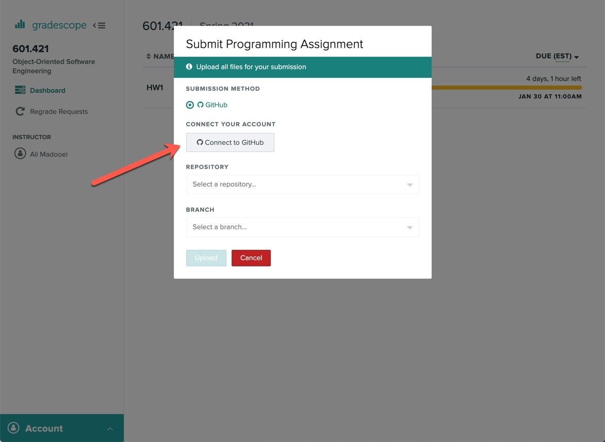
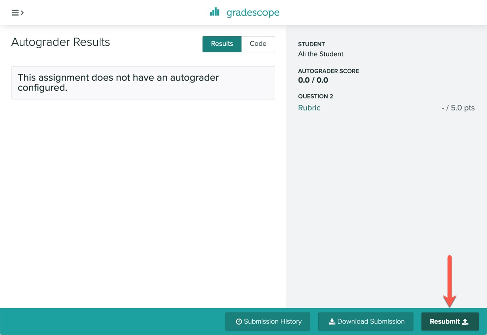

:::caution 
* You are expected to work individually.
* **Due: Monday September 19th at 11pm EST (Baltimore time).**
:::

## Learning Objectives

:::success Objectives
Warming/Brushing up (required background) technical skill-set for OOSE!
:::

:::danger
Before trying to make a submission for this homework, make sure you have successfully joined the course Github organization `jhu-oose-f22` (check out the `Logistics` page on the course website!)
:::

## Getting set up!
* Please go to [https://classroom.github.com/a/tqN17qG6](https://classroom.github.com/a/tqN17qG6)
* Login to your GitHub account and accept the invitation!
* A GitHub repository will be created for you. The repository is "private" and you must NOT change it to a "public" one. You must not add any collaborators to it. Clone this repository locally. Open the folder in your favorite text editor and start working on it.

## Task: MyBooks App

Recall the MyBooks App from Introduction chapter. Your task is to implement the MyBooks App.

:::info
You can choose any software stack and it is entirely up to you how basic or complex you will make it.
:::

You can build an app as simple as a single webpage with a button (called `Add` or `Submit`) and a textbox (where the user enter their favorite book name). The user enters a favorite book name, clicks on the button, and the book name gets stored in a database. Then it redirects to a page (or uses the same page) to show the list of all favorite books stored in the database. In comparison, you can build a full-fledged application where you can have separate list of favorite books per user, allow searching amongst saved favorite books, etc.

You have more than two weeks to build this app. We will give you the full mark for a simple minimal implementation! The goal here is to establish a baseline for your technical skill-set, and how much you can work and accomplish within the limited time. This includes how you test and document your application, organize your codebase, etc.

:::tip
The end-product does not need to be a web app! If your technical experience is in building mobile or desktop apps, feel free to build MyBooks App as one. The app must have the components of a minimal desktop/mobile app (UI + hosted database).
:::

:::tip
Make sure to include step-by-step instructions in `README.md` at the top level of you repository on how to run the app (locally). If you deploy your app somewhere online, please make sure to include the url also!
:::

:::caution 
Save all your project files in a folder named `hw1-task`.
:::

### Submission
* Go to [Gradescope](https://www.gradescope.com/courses/420577)
* Click on Homework 1.
* You will be presented with the submission prompt.
* Click on "Connect to GitHub".

You will be redirected to authorize Gradescope to communicate with the GitHub API and access your repositories! Once Gradescope and GitHub are linked, they stay linked! You don't need to repeat this process.

* Select your homework repository.
* Select the "main" branch.
* Hit Upload!

The files in your GitHub repository are now submitted as your homework submission.

:::caution
Gradescope does not automatically fetch changes from your GitHub repository. If you make any updates to your repository, you must "resubmit" your work to Gradescope. (The resubmission process is exactly the same as the first submission.)
:::

