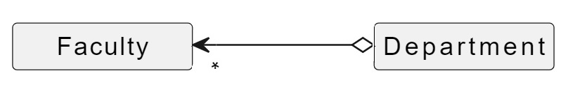

:::caution 
* You are expected to work individually.
* **Due: Friday September 2nd at 11pm EST (Baltimore time).**
:::

:::danger
Before trying to make a submission for this homework, make sure you have successfully joined the course Github organization `jhu-oose-f22` (check out the `Logistics` page on the course website!)
:::

## Getting set up!

* Please go to [https://classroom.github.com/a/DyrR-BPD](https://classroom.github.com/a/DyrR-BPD)
* Login to your GitHub account and accept the invitation!
* A GitHub repository will be created for you that contains the starter code. The repository is "private" and you must not change it to a "public" one. You must not add any collaborators to it. Clone this repository locally. Open the folder in your favorite text editor and start working on it.

:::tip
The starter repository, containing the code for task5, is also available [here](https://github.com/jhu-oose-f22/Homework2-Starter) if you ever need it.
:::

## Task 1: Client-Server Architecture

Name at least two benefits and one potential drawback of Client-Server Architecture.

:::info
Write the answer in `task1.md` file.
:::

## Task 2: Technology Stack

Suppose you are going to implement a new "Property Management" application using which you can pay your monthly rent, place maintenance orders, send/receive request with your landlord, see a list of community events etc. What type of application (Mobile, Web, or Desktop) will you go with? What kind of software architecture will you use? Finally, what software stack will you use? For each answer that you provide, write a few sentences to defend your pick(s).

:::info
Write the answer in `task2.md` file.
:::

## Task 3: UML Class Relationships
For each of the UML class diagrams shown below, indicate the name used to describe the relationship (e.g., an inheritance relationship) between the classes and describe what the diagram communicates about the relationship (e.g., interpret the multiplicity and navigability of a relationship).

:::info
Write the answer in `task3.md` file.
:::

## Task 4: From Model to Implementation
Consider the UML class diagram shown below:

It represents the design which models a personal library system. A person (i.e., user of the system) has one or more shelf where different items such as books and dvds are kept. You must include fields and methods that are necessary to support relationships between the other classes shown on the UML diagram but it is not necessary to include any others. Assume that you can both add and remove items from the shelf. Further, assume that the items must be stored in the shelf in the order in which they were added and that the shelf must not contain duplicate `Item` objects. 

:::info
Write simplest implementation for these classes (in Java) in files named `Shelf.java`, `Item.java`, `Book.java`, and `DVD.java`.
:::

## Task 5: From Implementation to Model

Draw a UML class diagram to represent the relationship of all the types (classes) in the starter repository that was cloned for you in the "Getting Setup" step. The Java files are part of the implementation of a system that models a few different types of animals.

:::info
Please draw the UML diagram using software such as https://diagrams.net/ and save it as an image `task5.png`. Hand-drawn diagrams will not be accepted.
:::

### Submission
* Go to [Gradescope](https://www.gradescope.com/courses/420577)
* Click on Homework 2.
* You will be presented with the submission prompt.
* Click on "Connect to GitHub".

You will be redirected to authorize Gradescope to communicate with the GitHub API and access your repositories! Once Gradescope and GitHub are linked, they stay linked! You don't need to repeat this process.

* Select your homework repository.
* Select the "main" branch.
* Hit Upload!

The files in your GitHub repository are now submitted as your homework submission.

:::caution
If you had already done the above steps to connect Github and Gradescope, then you would not need repeat them again here!
:::

:::caution
Gradescope does not automatically fetch changes from your GitHub repository. If you make any updates to your repository, you must "resubmit" your work to Gradescope. (The resubmission process is exactly the same as the first submission.)
:::

