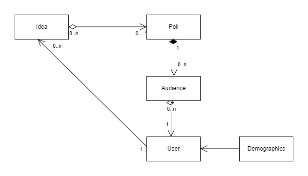

:::caution 
* You are expected to work individually.
* **Due: Wednesday September 14th at 11pm EST (Baltimore time).**
:::

:::danger
Before trying to make a submission for this homework, make sure you have successfully joined the course Github organization `jhu-oose-f22` (check out the `Logistics` page on the course website!)
:::

## Getting set up!

* Please go to [https://classroom.github.com/a/bDYS7atP](https://classroom.github.com/a/bDYS7atP)
* Login to your GitHub account and accept the invitation!
* A GitHub repository will be created for you that contains the starter code. The repository is "private" and you must not change it to a "public" one. You must not add any collaborators to it. Clone this repository locally. Open the folder in your favorite text editor and start working on it.

## Task 1: Identify Classes and Propose a Design

Assume you are designing an object-oriented software for a parking lot system. We have the following requirements/assumptions:

* Each parking lot is comprised of a number of parking spots
* Each vehicle must park in one spot
* There are three kinds of parking spots: small, medium and large for three types of vehicles motorcycles, cars and buses, respectively.
:::caution
A vehicle can only park in a parking spot of its size e.g., a motorbike would not be allowed to park in a medium or large spot and a car may only park in a medium spot.
:::

1. What classes/interfaces will be in your initial design? Just name them.

1. How are these classes/interfaces are related to each other. You must draw a UML class diagram and link it from within your (answer) document.
:::tip
You do not need to list class fields and/or methods, but if thinking in details helps you with your design, feel free to include them as well!
:::

1. Defend your suggested design; that is justify why you went with the above design.

:::tip UML Drawing 
There are many (free) online tools that you can use to sketch a class diagram quickly, for instance: https://www.diagrams.net/ 
:::

:::danger Save Your Answers
Write the answers in `task1.md` file. If there are any other files that you want to submit (e.g. an image file), name those `task1` as well (e.g., `task1.jpg`)
:::

## Task 2: Go Above & Beyond CRUD

Assume we have the following paragraph describing a cooking app named `CookBook`:

:::note CookBook summary
The goal of this project is to create a web application where we can view, remove, post, update and search among cooking recipes. The app allows its user to view, modify, and search for new cooking recipes using different filters e.g., title keywords, ingredients, recipe type, etc.
:::

### Answer the followings:

1. Is `CookBook` a CRUD application or does it go beyond CRUD? why or why not?
1. If `CookBook` is a CRUD app, come up with at least two ideas how to make this app go above and beyond CRUD?
1. Try and see if you can come up with a novel idea to make `CookBook` stand out from existing solutions? In other words, try to make `CookBook` different from the other popular cooking apps, such as [Allrecipes](https://www.allrecipes.com/) or [BigOven](https://www.bigoven.com/), that are already out there.
:::tip 
Note that part 2 and 3 of this task are open-ended questions. You might want to play around a little with existing cooking apps. Keep in mind though you do not need to spend lots of time on this, just try to get a sense of what existing solutions accomplish and then put your own spin into it. The goal here is not to come up with the next million-dollar business idea; rather just to practice brainstorming new ideas in the context of a real and tangible problem. 
:::

:::danger Save Your Answers 
Save your answers in`task2.md` file.
:::

## Task 3: Assess a Design

`InnovateNow` is an entrepreneurial discovery and browsing platform. A basic core feature of `InnovateNow` is to allow its users to post a short description of a novel idea they have to poll the general public and/or a select group of elite audience on their idea. The feedback is supposed to give the innovator a general basic idea whether their proposed idea has potential or not for further investigation. Innovators will also be able to collect demographic and customer information through the results of the polling.

Here is a design an engineer came up with for the software specification above:

1. Does this design meet the specification of the software system needed by `InnovateNow`? If there is any shortcoming or issues, please point them out. 
1. Does this design adhere to the good characteristics of "High Cohesion" and "Low Coupling"? Would you make any changes to increase cohesion or decrease coupling anywhere in this design? If so, where? If not, defend the current design.

:::danger Save Your Answers 
Save your answers in`task3.md` file.
:::

### Submission
* Go to [Gradescope](https://www.gradescope.com/courses/420577)
* Click on Homework 3.
* Select your homework repository.
* Select the "main" branch.
* Hit Upload!

The files in your GitHub repository are now submitted as your homework submission.

:::caution
Gradescope does not automatically fetch changes from your GitHub repository. If you make any updates to your repository, you must "resubmit" your work to Gradescope. (The resubmission process is exactly the same as the first submission.)
:::
