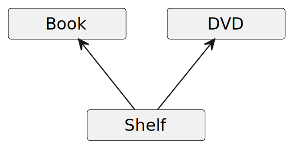
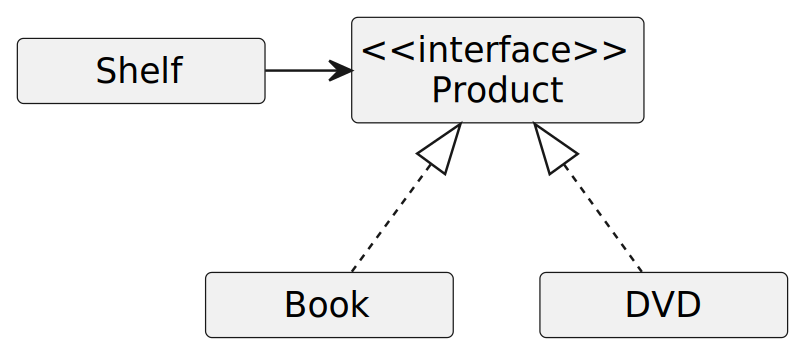

:::success Learning Objectives
* Writing SRS
* SOLID Design Principles (based on [Design Principles Readings](https://jhu-oose-f22.github.io/cs421/docs/readings/wk2/dp))
:::


:::caution 
* You are expected to work individually.
* **Due: Friday September 16th at 11pm EST (Baltimore time).**
:::

## Getting set up!

* Please go to [https://classroom.github.com/a/qezZi22c](https://classroom.github.com/a/qezZi22c)
* Login to your GitHub account and accept the invitation!
* A GitHub repository will be created for you that contains the starter code. The repository is "private" and you must not change it to a "public" one. You must not add any collaborators to it. Clone this repository locally. Open the folder in your favorite text editor and start working on it.


## Task 1: Write SRS

In [homework 3's task 2](hw3#task-2-go-above--beyond-crud), you answered some questions on an app named `CookBook`. Complete a [SRS](https://docs.google.com/document/d/1xsof7GoMBMUrotWfhQoi5YFlcOT0bSS93RN3pCJ-Ukw) document for `CookBook` and make sure the features you proposed there to go above and beyond CRUD are also included!

:::caution
When listing your "Must-have" and "Nice-to-have" features in the SRS, make sure to write them in *role-goal-benefit* form.
:::

:::danger Save Your Answers
Write the answers in `task1.md` file.
:::

## Task 2: Design Principles 1

Consider the following interface and classes:

```java
public interface Payment {
    Object status();
    void initiatePayments();
    void intiateLoanSettlement();
    void initiateRePayment();
    // possibly more method declarations
}
```

```java
public class LoanPayment implements Payment {
    @Override
    public void initiatePayments() {
        throw new UnsupportedOperationException("Not a bank payment");
    }
    // implementation of the other LoanPayment methods including the 
    // ones declared in (and required by) the Payment interface
}
```

```java
public class BankPayment implements Payment {
    @Override
    public void intiateLoanSettlement() {
        throw new UnsupportedOperationException("Not a loan payment");
    }
 
    @Override
    public void initiateRePayment() {
        throw new UnsupportedOperationException("Not a loan payment");
    }
    // implementation of the other BankPayment methods including 
    // the ones declared in (and required by) the Payment interface
}
```

What specific design principle(s) has/have been compromised here? How would you modify this design so that it complies with the compromised design principle(s)? Explain in details.

:::danger Save Your Answers
Write your answers in `task2.md`.
:::


## Task 3: Design Principles 2

Assume, you have designed & implemented a chess game app for a client! In your design, you have a class named `Board` that represents, well, a chess board! In your `Board` class there are a set of class fields and methods along with a class field (which is a 2D array) to store the pieces on the board and a method named `setLocation(int x, int y)` to set the value of a particular location (to empty or a certain piece) on the board where `x` and `y` are the coordinates on the board. Now, the client comes back to you with some novel idea! of creating a 3D chess (with a whole new set of rules, etc.!)

Naturally, you go back to the existing design you already have to start the process of creating the 3D chess. One idea that comes to mind to represent the new 3D board is to introduce a new class named `Board3D` that *extends* `Board`. Is this a good idea or a bad idea? Defend your answer in the light of SOLID principles.

:::tip
Note that the specific rules of this new 3D chess is not our focus; rather, we are more concerned about how `Board3D` to `Board` are related.
:::

:::danger Save Your Answers
Write your answers in `task3.md`.
:::


## Task 4: Design Principle 3

A team of students are building a Bookstore Management Software. The starting UML design includes the following:



The team's advisor suggested this alternative design instead:



Briefly explain what SOLID design principle(s) the advisor's revised design adheres to? 


:::danger Save Your Answers
Write your answers in `task4.md`.
:::

### Submission
* Go to [Gradescope](https://www.gradescope.com/courses/420577)
* Click on Homework 4.
* Select your homework repository.
* Select the "main" branch.
* Hit Upload!

The files in your GitHub repository are now submitted as your homework submission.

:::caution
Gradescope does not automatically fetch changes from your GitHub repository. If you make any updates to your repository, you must "resubmit" your work to Gradescope. (The resubmission process is exactly the same as the first submission.)
:::