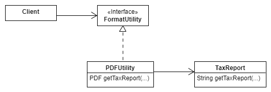

:::success Learning Objectives
* UML, Identify Classes, Client-Server, User Stories
* SOLID Design Principles
* Design Patterns (based on [Design Patterns Readings](https://jhu-oose-f22.github.io/cs421/docs/readings/wk3/dp))
:::


:::caution 
* You are expected to work individually.
* **Due: Wednesday September 21st at 11pm EST (Baltimore time).**
:::

## Getting set up!

* Please go to [https://classroom.github.com/a/_fUx2YYI](https://classroom.github.com/a/_fUx2YYI)
* Login to your GitHub account and accept the invitation!
* A GitHub repository will be created for you that contains the starter code. The repository is "private" and you must not change it to a "public" one. You must not add any collaborators to it. Clone this repository locally. Open the folder in your favorite text editor and start working on it.


## Task 1

Imagine you have been asked to implement a Piazza-like system (Q/A and discussion for courses). One of your team members defines the following User Story:

* As a professor, I would like to be able to post announcements so that they appear on my students’ feed.

1. You are implementing this User Story; what classes will be in your "model" UML class diagram? (Only name the classes.)

2. The software system is implemented according to the Client-Server Architecture. To show your understanding of this architecture, describe how the above-stated User Story carries out through the interaction between different entities (user, client, server, database, ...) .

3. Based on the above-stated User Story (and your general understanding of how a Piazza-like system works), what design pattern(s) [among those we covered in lecture/readings] would be primed for application here. Name only one and elaborate (briefly) on the underlying problem and the proposed solution by the pattern (relate that to how the pattern fits here).

:::caution Save Your Answers 
Save your answers in `task1.md`. 
:::

## Task 2

Consider the following design, where client can access tax reports of people:



What specific design principle(s) does/do this design adhere to? Name as many as you can and explain each in details.

What particular design pattern, if any, has been applied in this design?

:::caution Save Your Answers 
Save your answers in `task2.md`. 
:::

## Task 3

Consider the following class:

```java
public class CreateImageReader {
   private CreateImageReader() {}
   public static ImageReader createImageReader(InputStream is) {
      int imageType = figureOutImageType(is);
      switch(imageType) {
        case CreateImageReader.GIF:
           return new GifReader(is);
        case CreateImageReader.JPEG: 
           return new JpegReader(is);
      }
   }
}
```
Name the design pattern the above class implements and explain the named design pattern in a sentence.

1. Why does it make sense to make the constructor of CreateImageReader class private?

2. Assume fis is an instance of FileInputStream associated with a binary file that stores a GIF image. How do you make use of the above class in order to read the GIF image? Write the java statement.

:::caution Save Your Answers 
Save your answers in `task3.md`. 
:::

## Task 4

Consider the followings:

```java
interface Product {
    int price();
}
```

```java
class DVD implements Product {
    // implementation of DVD omitted
}
```

```java
class Book implements Product {
    // implementation of Book omitted
}
```

```java
class Shelf implements Product {
    private products List<Product>;
    // implementation of Shelf omitted
}
```

1. What design pattern is being implemented here?

2. Assuming the `price()` function is implemented in `DVD` and `Book` classes, provide an implementation for `price()` inside the `Shelf` class.

:::caution Save Your Answers 
Save your answers in `task4.md`. 
:::

### Submission
* Go to [Gradescope](https://www.gradescope.com/courses/420577)
* Click on Homework 5.
* Select your homework repository.
* Select the "main" branch.
* Hit Upload!

The files in your GitHub repository are now submitted as your homework submission.

:::caution
Gradescope does not automatically fetch changes from your GitHub repository. If you make any updates to your repository, you must "resubmit" your work to Gradescope. (The resubmission process is exactly the same as the first submission.)
:::