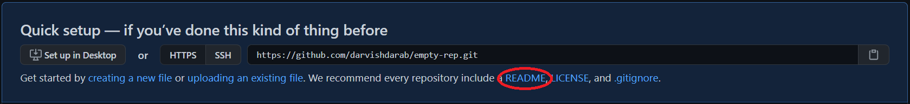

:::success Learning Objectives
* Git & Github ([Git&Github Readings Readings](https://jhu-oose-f22.github.io/cs421/docs/readings/wk1/git))
* Refactoring ([Refactoring Readings](https://jhu-oose-f22.github.io/cs421/docs/readings/wk2/refactoring))
:::


:::caution 
* You are expected to work individually.
* **Due: Friday September 23rd at 11pm EST (Baltimore time).**
:::

## Getting set up!

* Please go to [https://classroom.github.com/a/ZNCFp2u3](https://classroom.github.com/a/ZNCFp2u3)
* Login to your GitHub account and accept the invitation!
* A GitHub repository will be created for you that contains the starter code. The repository is "private" and you must not change it to a "public" one. You must not add any collaborators to it. Clone this repository locally. Open the folder in your favorite text editor and start working on it.


## Task 1: Refactoring

1. Consider the following code to get the credit score of a user (i.e., person) from a credit agency as part of a loan-lender app. Can you identify and name a particular code smell (among the ones we have covered in class)? How would you go about fixing the code smell? Explain.

```java
// ...
CreditAgency cA;
// code to properly initialize cA
int score = cA.getCreditScore(personFirstName, personLastName, personSSN, personAdddress);
// more code
```

2. Identify and name a code smell in class `Person` (among the ones we have covered in class)? How would you go about fixing it/them? 

:::tip
There might be more than one occurrence of a particular code smell!
:::

```java
public class Person { 
    String fullName;
    String mailingAddress;
    String email;

    // method implementations 
}
```

:::caution Save Your Answers 
Save your answers `task1.md`. 
:::

## Task 2: Git & Github

In this task, you will get practice with Git and GitHub. You are expected to be using a terminal for working with Git. You must follow the instruction below. Some of the instructions require you to run Git commands in the terminal. You must keep a log of the Git commands you use, in the order you use them, in the `task2.md` file.

1. Make a folder called `task2`. Open the terminal and change the working directory to `task2` folder.

1. Initialize a Git repository in this folder.

1. Add a `README.md` file and write `This is a readme file!` in it and save it.

1. Add and commit changes with a descriptive commit message. (For all the following instructions, when you "commit", we expect that you enter a descriptive commit message.)

1. Go on GitHub and make an empty repository under your own account (not `jhu-oose-f22` organization!). 
:::tip
It doesn't matter what you call this repo, and whether it is public or private!
:::

1. Push your local repository to the remote (GitHub repository) that you've created.

1. Open the `README.md` on GitHub and rewrite the `README.md` to contain `This is a remote readme file!`. Save (commit) the file on GitHub. Next, edit the local copy of `README.md` to contain `This is a local readme file!`.   



:::info
Notice the only difference between the README on GitHub and on your local computer is the words `local` vs. `remote`.
:::

8. Commit the changes on your local repository and try to push them to the remote repository. This should not work! Try to solve the problem. (As you solve the problem, more problems may arise, including a merge conflict! You should resolve the conflict, and eventually when all issues are resolved, both local and GitHub repository must contain `This is a readme file!`)

9. Assume your repository contains the code for your software. Moreover, assume we are going to add a new feature to your software using the [GitHub Flow](https://guides.github.com/introduction/flow/).
10. Go to your repository on GitHub.
11. Create an issue with the title "Making feature 1!".
12. Create a new branch on your local repository and call it `feature1`.
13. Make a new file `FEATURE1.md` in this new branch and write `This is feature 1!` in it!
14. Commit changes and push to remote (GitHub) repository. You must get an error now. Try to solve it! (_Hint: pay attention to the error message!_)
15. Once you've resolve the issue and committed the changes to the remote repository, go to GitHub and create a [pull request](https://docs.github.com/en/github/collaborating-with-pull-requests/proposing-changes-to-your-work-with-pull-requests/about-pull-requests) to merge the `feature1` branch to the `main` branch.
16. Approve the pull request and merge the `feature1` branch to the `main` branch.
17. After the merge has been successful, close the issue related to adding the new feature.
18. Go on to your local repository and pull the latest changes from remote to your local `main` branch.


:::tip
You may consult git and github documentations to look up various git commands and how to do things on Github! Here are some resources:
* Git cheat-sheet: [https://education.github.com/git-cheat-sheet-education.pdf](https://education.github.com/git-cheat-sheet-education.pdf)
* Git tutorial: [https://git-scm.com/docs/gittutorial](https://git-scm.com/docs/gittutorial)
* Github Docs: [https://docs.github.com/en](https://docs.github.com/en)
:::
:::caution Save Your Answers
Save your answers in `task2.md`.
:::


### Submission
* Go to [Gradescope](https://www.gradescope.com/courses/420577)
* Click on Homework 6.
* Select your homework repository.
* Select the "main" branch.
* Hit Upload!

The files in your GitHub repository are now submitted as your homework submission.

:::caution
Gradescope does not automatically fetch changes from your GitHub repository. If you make any updates to your repository, you must "resubmit" your work to Gradescope. (The resubmission process is exactly the same as the first submission.)
:::