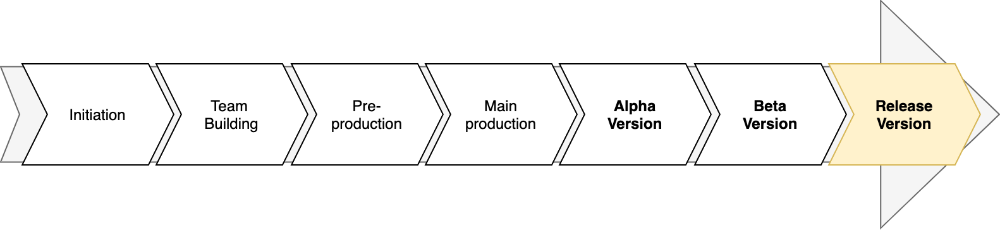

## Overview

:::info Iteration 4  goal
By the end of this iteration you will release the **Alpha Version** of your software application (**read about alpha release further below**):
* By the end of this iteration, you must have the *latest version* of your app deployed online (e.g., on Heroku.)
* Also, this iteration is the time to start adding generic features such as a login (**read login section below!**) 
* Finally, you want to start making the front-end of the app look nice(r) if you have been mostly focused on the back-end so far. If you were already invested on front-end development, use the time to futher develop your core features and nice-to-have features (on the back-end side of things!)
:::

These are the deadlines for this iteration. 

|Component                           | Date         | Time     |
| ---------------------------------- | ------------ | -------- |
| Retrospective for iteration 3 | Tue NOV 9th | 12:00PM (NOON) |
| Updated Software Requirement Specification   | Tue NOV 9th | 12:00PM (NOON) |
| Updated Class Diagram | Tue NOV 9th | 12:00PM (NOON) |
| Updated Github Board | Tue NOV 9th | 12:00PM (NOON) |
| Deliverable (source code of a working app) | Tue Nov 16th | 11:00 PM |
| Deployment (latest version of fully functioning app available online) | Tue Nov 16th | 11:00 PM |
| Individual Contribution Report | Wed Nov 17th | 11:00 PM |

### Login Functionality

Designing and implementing a secure and robust login mechanism is difficult to get right. This is because much of a proper and secure login system has to do with security aspects of it. Therefore, this is best left to the security experts. After all, we are software engineers not securty experts! Besides, there are many solutions and APIs nowadays that can be leveraged to add a nice and secure login functionality to your app, so why reinventing the wheel? In here I am going to list several different user authentication approaches along with some resources for each approach:

#### 1. Sign in via Popular Platforms Account

Most people nowadays have facebook, google, twitter etc. accounts. So, you can have people authenicate themseleves using their account credentials that they already have on these platforms to get into your app. The following links should get you started:

* [Google Sign in](https://developers.google.com/identity/sign-in/web/sign-in)
* [Facebook Sign in using Facebook SDK for Javascript](https://developers.facebook.com/docs/facebook-login/web)
* [Twitter Sign in](https://developer.twitter.com/en/docs/authentication/guides/log-in-with-twitter)

:::tip
I am personally a fan of this approach, as a user-friendly way of getting people authenticated, becuase almost all people nowadays have an account with one or more of these platforms. This makes it easier on the users to get in to your app by just pushing few buttons; they do not have to go through the sign up and verification processes on your app and they do not need to create/remember yet another username and password! Also, you can support multiple of these platforms in your app at the same time providing multiple ways for your users to get in!
:::

#### 2. JHU SSO

If you are interested to authenticate your app users via their JHU credentials in order to get access to your app, you can read/follow this link:

[JHU Single Sign On Tutorial](https://cs280fall20.github.io/jhu-sso/index.html)[^1]

[^1]: This tutorial is prepared and put together by my wonderful colleague Prof. Ali Madooei!

:::tip
Please note JHU SSO only makes sense if your (potenial) users are JHU people. If your app targets a wider spectrum of people beyond JHU, then obviously JHU SSO is not the way to go!
:::

#### 3. Dedicated Third-Party Solutions/APIs

If you have read 1 and 2 and still want to implement your own sign up/in functionality and/or use a dedicated authentication solution, then you can either leverage some APIs that can do some of the heavy lifting for you or use a dedicated highly-secure highly-customizable solution. There are both commerical and non-commerical solutions in this domain. Here are a few of them:

* [auth0](https://auth0.com/docs/api/authentication)
* [Web Authentication API](https://developer.mozilla.org/en-US/docs/Web/API/Web_Authentication_API)
* [Okta Authentication API](https://developer.okta.com/docs/reference/api/authn/)

:::tip
This approach is usually most applicable/suitable and is worth the extra effort/cost when security is of utmost importance (e.g., a banking app).
:::

:::caution disclaimer
I am no expert in any of the above solutions/APIs and have not used any of them in any serious capacity. I merely provide these here to give you starting points and give you an idea about alternate ways of adding a user authentication layer to your app. It is on you to explore the above-mentioned solutions further and decide which one is most suitable for your app needs. **Going into the details of various user authentication mechanisms is beyond the scope of OOSE!** Having said these, I would be happy to chat about your app needs and discuss which approach/solution may make the most sense for your needs!
:::

### Retrospective for iteration 3

You **must** write a _Retrospective_ for iteration 3. The retrospective is an opportunity for your team to inspect itself and create a plan for improvements to be enacted during the next iteration. Review what you had done in iteration 3; note things that you have and have not delivered, note the challenges you had, and reflect on how you shall proceed in the next iteration to do a better job. There is not specific format to the retrospective document and no minumin and/or requirements on its length, format etc. It is just meant to reflect on iteration 3 and use it to improve your next iterations. Write this in a file named `retrospective_it3.md` and upload it under `docs` folder in your group repo.

### Update Software Requirement Specification

You only need to update the Requirement Specification Document if you want to make any changes to the specification of your proposed software project. That is, you can leave it as is, if you are happy with it.

### Update Class Diagram

If there has been been any changes to your desgin since last iteration, make sure to update your class diagram to reflect the latest design of your software. Upload a new class diagram picture to the `docs` folder. Make sure to include `it4` in the file name(s) e.g. _`it4_class_diagram1.png`_

:::tip
Remember that your class diagram must be kept updated at all times. (i.e., iterations)
::::

### Project Planning: Giuthub Project Board

Similar to previous iterations, create three columns "It4-To Do" with _preset_ `To do`, "It4-In Progress" with _preset_ `In Progress`, and "It4-Done" with preset `Done`. You will need to keep the colmuns updated as you develop your app further. List all your _to do_ tasks extracted from the user stories you plan to finish for iteration 4 under the "It4-To Do" column. When you start working on a task, move it under the "It4-In Progress" column, and when it is completed list it under the "It4-Done" column. 

:::tip 
Ideally, you do not have any unfinished tasks from previous iterations. But, if there are unfinihsed tasks, move them over to the _it4_ columns and aim to get them done in this iteration.
:::

:::caution
In this iteration, you are releasing the alpha version of your software. In real world, this equals to releasing a software to limited audience. This means your "must have" features are all done and, ideally, the _high priority_ "nice-to-have" feature(s) are also finished.
:::

### Final Deliverable 

At the end of iteration 4, **you must deliver the Alpha Version of your software application**.

Your application must also be deployed (assuming you are developing a web app) to a platform like Heroku.

:::info What is _Alpha_ release?
Alpha is an important milestone that you accomplish as a team while developing a software.

In this stage, the application's core features i.e. the must have features are working (although they may not be refined).

Once the Alpha stage has been met, the team then extensively test and refine the features along with other elements to improve the fidelity and meet the software design requirements.

After Alpha stage, the development heads to Beta and then finally, GOLD (final release).

To learn more about *Software Release Life Cycle*, refer to [this Wikipedia article](https://en.wikipedia.org/wiki/Software_release_life_cycle).
:::

You must always keep your group repository updated with the latest changes; we will consider your **last commit by Tue, NOV 16th, 11:00 PM as your submission.**

:::caution
Do not forget to update you project's `README.md` if needed.
:::

### Deployment

By the end of this iteration, a stable copy of your latest app must be deployed online. You can either deploy to Heroku following what you have done in homework 6, but feel free to deploy to alternate platforms (if you have something specific in mind.) Ideally, you also want to setup an automated deployment pipeline for your app similar to what you did in class. This will probably save you time and energy in the longer run, since you can set things up once and then rely on them thereafter, but it is not required! Your app must be online and fully functioning by **Tue, NOV 16th, 11:00 PM**. 

:::caution
Make sure to include the url of the app along with any particular instructions or things to note in your `README.md`.
:::

### Individual Contribution Report

Each member in the team must write a short individual report. This must be done _individually_, hence the name individual report!; you may not work on this together. This does not have to be long and there are no hard requirements on the format, length, content etc. of this document. However, you should use this to 1) reflect on your own individual performance in iteration 4, and 2) mention the names of any particular member(s) who you think excelled in the last iteration. 

:::info
This should not be the case hopefully, but if you have major concerns about performance of any other member(s) i.e. someone who is not putting in the necessary effort/time, is not committed to the team's mission etc., make a mention of it in your individual report. We will check these individual reports and we will take necessary actions if needed. Submit your individual report to your personal repo in the `jhu-oose` organization in a file named `it4_individual_report.md`.
:::

:::danger submit individual report to your private repo
We have provisioned you a personal repo at the begining of the semester and you must still have access to it. This is different from your project/team repo that you use to submit your homeworks and other iteration deliverables. **Submit the individual report to your private repo, not the team repo!**
:::

