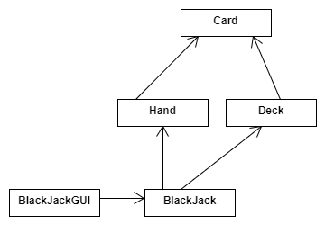
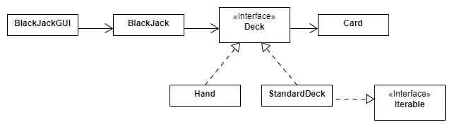

## True/False

Please indicate if each statement is `true` or `false`.


### Statements

1. The **dependency inversion principle** in object-oriented design is  always  being used if we define and use interfaces.
    ::tip ANSWER
    __False__: Defining Interfaces does not necessarily mean we comply with DIP; DIP says High-level classes shouldn't have to change because low-level classes change. For example, we may define an interface, but a dependent class might still continue to depend on a subclass of the newly defined interface instead of depending on the interface
    :::
1. In Object-Oriented programming (OOP), the primary purpose of "polymorphism" is to reuse your code.
    :::tip ANSWER
    __False__: The primary purpose of _Inheritance_ is code reuse, but Polymorphism (having many forms) is the ability of an entity in an object-oriented model to refer to objects of different classes at different times
    :::
1. Coupling is a measure of how strongly one element in code (such as a class or a method) is _focused_ and comprise of responsibilities which belong together. 
    :::tip ANSWER 
    __False__: coupling refers to the degree of direct knowledge that one element has of another. In other words, how often do changes in class A force related changes in class B. 
    :::
1. Open-closed principle states when extending a class, consider that you should be able to pass objects of the subclass in place of objects of the parent class without breaking the client code.
    :::tip ANSWER 
    __False__: OCP states classes should be open for extension but closed for modification.
    :::
1. Adapter is a structural design pattern that allows objects with *incompatible* interfaces to collaborate
    :::tip ANSWER
    __True__
    :::


## Multiple-Choices


Please indicate the correct choice (there is only one for each question).


### Questions

1. In software development, "**requirements**" are about:
   - [X] a. what the software system should do
   - [ ] b. how the software system should work
   - [ ] c. both about what the software system should do and how the system should work
   - [ ] d. none of the above

2. When the **REST principle** is being used to describe the interactions between a *client* and a *server*:
   - [ ] a. the **server** maintains the  state  of the client
   - [ ] b. the client can send different kinds  of http requests: *create*, *get*, *put*, *post* and *delete*
   - [X] c.  the **client** maintains  state 
   - [ ] d. both the client and the server maintain state

3. When using an agile development process, the **product backlog**:

   - [ ] a. is a  list of the products  a company needs to build
   - [X] b. is a  prioritized list of backlog items  specific to the product  under development 
   - [ ] c. is a list of  defect  associated with the  current  product
   - [ ] d. is a list of  engineering tasks  negotiated by the team and the customer about the  current  development project


4. Which SOLID design principle is  most closely  described by the given statement: **classes should depend on abstractions rather than implementations.**

   - [ ] a. Single Responsibility Principle
   - [ ] b. Open/Closed Principle.
   - [ ] c. Liskov Substitution Principle.
   - [ ] d. Interface Segregation Principle
   - [X] e. Dependency Inversion Principle

5. DRY design principle is associated with which code smell?
   - [X] a. code duplicates
   - [ ] b. data clumps
   - [ ] c. primitive obsession
   - [ ] d. a and b 
   - [ ] e. none

6. Which statement is always true about refactoring?
   - [ ] a. Refactoring is a disciplined technique for restructuring an existing body of code
   - [ ] b. Refactoring alters a source code internal structure without changing its external behavior.
   - [ ] c. Refactoring usually comes in two steps: 1) identify a potential problem and 2) remedy the problem
   - [X] d. a, b, and c
   - [ ] e. a and b

7. Which statement(s) are true about MVC design pattern? (select all that apply)

    - [X] a. The actual application logic does not necessarily fit into any of Model, View or Controller components.
    - [ ] b. View is the bridge between the model and controller.
    - [X] c. MVC is commonly used to design web applications.
    - [ ] d. Model is the component that first receives requests from the client.


### Short Answer

1. Looking at the following Java code, can you name a specific design pattern that the ArrayList class utilizes? Explain the design pattern. 

```
import java.util.ArrayList;
import java.util.Iterator;

public class Main {
  public static void main(String[] args) {
    // Make a collection
    ArrayList<String> cars = new ArrayList<String>();
    cars.add("Volvo");
    cars.add("BMW");
    cars.add("Ford");
    cars.add("Mazda");
    Iterator<String> it = cars.iterator();
    System.out.println(it.next());
  }
}
```

:::tip ANSWER
Iterator Pattern. Iterator is a behavioral design pattern that lets you traverse elements of a collection without exposing its underlying representation
:::

2. Consider the following code snippet (given inside a function/method e.g. main):

```
int array_a[4];
int array_b[4];
 
int sum_a = 0;

for (int i = 0; i < 4; i++)
   sum_a += array_a[i];

int average_a = sum_a / 4;
 
int sum_b = 0;

for (int i = 0; i < 4; i++)
   sum_b += array_b[i];

int average_b = sum_b / 4;
```

What specific code smell (from among the ones we covered in class) can you identify in the code? Now, imagine someone in your team proposes the following over what is given above:

:::tip ANSWER
Duplicate Code
:::

```
int calc_average_of_four(int array[]) {
   int sum = 0;
   for (int i = 0; i < 4; i++)
       sum += array[i];

   return sum / 4;
}

int array1[4];
int array2[4];

int average1 = calc_average_of_four(array1);
int average2 = calc_average_of_four(array2);
```

What remedy is being done here for the identified code smell?

:::tip Answer
Extracting the duplicate code into a stand-alone method.
:::


## Analysis and Design 1

A team of students are building card game application. They are considering to implement the game of Blackjack in their first two iterations. Their UML design includes the following:




The team advisor suggested this alternative design:




### Part 1
Briefly explain what SOLID design principle(s)  the advisor's revised design adheres to.

:::tip answer
* Dependency Inversion Principle: An abstraction (Deck interface) is introduced between the high-level classes (Blackjack & BlackjackGUI) and low-level classes (Hand & StandardDeck) that changes the direction of the dependency and splits the dependency between the high-level and low-level modules.
* Open/Closed Principle: To extend the application, e.g. a Blackjack Shoe, all needs to be done is to add another concrete implementation of the Deck interface. The extention (adding a new Deck) will not require any changes to the classes already exsiting in the model.
* Interface Segregation Principle: A concrete implementation of Deck does not have to implement Iterable; the Deck interface is kept small
:::


### Part 2
Briefly explain what design patterns (among those we've learned in this course) the advisor's revised design adheres to.

:::tip answer
Iterator Pattern: StandardDeck implements Iterable which is an indication of an attempt to employ the Iterator Pattern. It allows iterating over the Cards in a StandardDeck (perhaps in random order to simulate the shuffling and drawing behaviours).
:::


### Part 3
You are asked to criticize the advisor's revised design; what would you suggest?

:::tip answer
One reasonable argument is that applying the design principles/patterns has made the design more complicated than it should be. The added complexity can slow down the delivery for this iteration. The group could go ahead with their implementation and refactor their code in future iterations when adding new features. Other reasonable arguments can be made here as well.
:::


## Design and Analysis 2

Suppose you are designing a software application that will allow the users to perform task management. The user can add tasks to the system and can group tasks together into projects. Projects can be added as sub-projects of other projects, nested arbitrarily deep. Each tasks has an estimated time for completion that is specified when the task is constructed. You want to be able to treat individual tasks and projects in the same way. In particular, you want to be able to get the time needed to complete a task or a project. The time taken to complete a project is the total time needed to complete all the tasks in the project or in sub-projects of that project. 

### Part 1

Based on the software description, write two "must have" (functional) requirement in form of User Stories.

:::tip possible answer
* As a user, I want to group tasks into a project so that I can better manage my tasks.
* As a user, I want to assign estimated completion time to each task so that the software give me the time needed to complete a project.
:::


### Part 2

This application conforms to the Client-Server software architecture. To show your understanding of this architecture, describe one use-case (a scenario involving a user using the proposed software) and indicate the interaction between different entities (user, client, server, database, ...) involved in the use-case.

:::tip possible answer
* (User clicks on "add task" button on the client application.
* The client application collects the information provided for the task and sends a request to the server to create and store the task. 
* The server recieves the requests. It creates a task with the provided information. Stores the task in the database. Upon sucessfull completion of this process, the server sends a response to the client application.
* The client application, upon reciving the server's response, displays the newly added task in the list of tasks.
:::


### Part 3

Based on the software description, what design pattern(s) [among those we covered in lecture/readings] would apply to the design of this application. **Name** the design pattern and **elaborate** (briefly) on the problem and proposed solution (how it fits here).

:::tip possible answer

**Composite Design Pattern**:

* Problem: We need to manipulate a hierarchical collection of "primitive" and "aggregate" objects. Moreover, we need to process (treat) aggregate objects the same way as primitive objects.
    * The primitive object is a Task.
    * The aggregate object is a Project.

* Solution: 
    * Following the pattern, we can create an abstraction like AbstractTask class with an abstract method getEstimatedCompletionTime(). 
    * We implement a Task class that extends AbstractTask.
    * We implement a Project class that extends AbstractTask but also contains a collection of AbstractTasks with methods to add/remove AbstractTasks.
:::


## Analysis and Design 3

Consider the following UML class diagram: A **Client** class uses **TextAnalyzer** interface which provides different functionalities (i.e., different kinds of text analysis) for a piece of text. 


Sentiment Analysis aims to detect positive, neutral, or negative feelings from text. For example, here are few inputs and outputs of a sentiment analyzer:

```plain
"I really like the new design of your website!" → Positive
"I'm not sure if I like the new design" → Neutral
"The new design is awful!" → Negative
```

There is also a "Translator" class that "SentimentAnalyzer" uses to translate a text from a source language into English before passing it into "EnglishSentimentAnalyzer" for the actual sentiment analysis to be done. Note though that the "Translator" is capable of translating between any two languages i.e., from a **"source"** language to a **"target"** language. Given these assumptions/descriptions, answer the following questions:

1. What is the type of relationship between `SentimentAnalyzer` and `TextAnalyzer`?

:::tip Answer
*Implements* (more like `SentimentAnalyze` is-a `TextAnalyzer`). The `SentimentAnalyzer` implements the `TextAnalyzer` interface.
:::

2. What is the **specific** type of relationship between `SentimentAnalyzer` and `Translator`?

:::tip Answer
Aggregation. `SentimentAnalyzer` *has a* `Translator`. Aggregation is a specific type of Association indicating *strong ownership*.
:::

3. What design pattern is used here? *Name only one that is most relevant from among the ones discussed in class!* Defend/justify your answer by explaining in details how the named design pattern is being used.

:::tip Answer
Adapter Design pattern is being used here. This allows objects of incompatible interfaces to collaborate. Take the SentimentAnalyzer,EnglishSentimentAnalyzer, and GermanSentimentAnalyzer classes for example. All these seem incompatible but the UML diagram allowed for these to collaborate. The SentimentAnalyzer class points to the EnglishSentimentAnalyzer and perhaps the GermanSentimentAnalyzer (a form of association) as the next question suggests. For a given language that the SentimentAnalyzer analyzes (say English or German), it calls the corresponding EnglishSentimentAnalyzer or GermanSentimentAnalyer or whatever languages's sentimentAnalyer. This is similar to the examples of adapter design patterns we mentioned in class. 
:::

4. What SOLID design principle(s) is/are used here other than Single Responsibility Principle? Defend/justify your answers by explaining in details how the named design principles are being used.

:::tip Answer
Dependency Inversion Principle. The high level class called `Client` does not depend on the low level classes of `SentimentAnalyzer`. Both the `SentimentAnalyzer` and the `Client` depend on the abstraction `TextAnalyzer` interface. 

Another design principle that seem to be used here is the Open Closed Principle. Different types of analyzers such as SentimentAnalyzer implement the TextAnalyzer interface without breaking the TextAnalyzer functionality. We can also have another type of TextAnalyzer inherit the SentimentAnalyzer interface without breaking the functionality of the TextAnalyzer interface. Open for extension and closed for modifications.
:::

5. How would you go about making a call from the `analyze` method in `SentimentAnalyzer` class to the `analyze` method in `EnglishSentimentAnalyzer` class? Write the Java statement(s) for it or explain the exact steps.

:::note
Pay close attention to the method signatures listed for each class in the class diagram.
:::

:::tip Answer
```
String engtxt = Translator.translate(language, "English", text); 
return EnglishSentimentAnalyzer.analyze(engtxt, "English");
```
:::

6. Suppose we decide to add support in our system for sentiment analysis in German language. Where does the class "GermanSentimentAnalyzer" fit in this design? You do not need to draw anything, only explain where exactly the class "GermanSentimentAnalyzer" gets incorporated into the class diagram and the type of relationships it will have with other classes/interfaces.

:::tip Answer
It will need German input so we use translator to translate any language into German first then call the `GermanSentimentAnalyzer`'s analyze function on translated text. `GermanSentimentAnalyzer` class can be add into the diagram the same way as `EnglishSentimentAnalyzer`.
:::