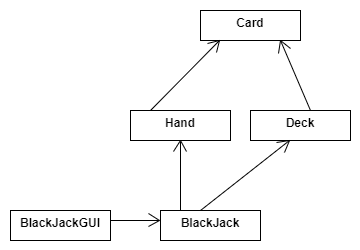
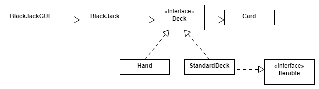
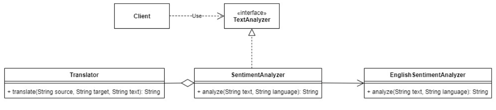

:::danger
Note that the followings are **Sample** questions only and their purpose is to provide some practice with the concepts/material covered in the class. The following is NOT a representative of the actual quiz test by any means. The actual exam may (and probably will) be different in terms of level of difficulty, types of questions, length, format, content etc. In general, if you have studied and have a deep understanding of the material covered in the class, you should have no problem in taking the quiz!
:::


## True/False

Please indicate if each statement is `true` or `false`.


### Statements

1. The **dependency inversion principle** in object-oriented design is always being used if we define and use interfaces.
1. In Object-Oriented programming (OOP), the primary purpose of "polymorphism" is to reuse your code.
1. Coupling is a measure of how strongly one element in code (such as a class or a method) is _focused_ and comprise of responsibilities which belong together.
1. Open-closed principle states when extending a class, consider that you should be able to pass objects of the subclass in place of objects of the parent class without breaking the client code.
1. Adapter is a structural design pattern that allows objects with *incompatible* interfaces to collaborate


## Multiple-Choices

Please indicate the correct choice (there is only one for each question).


### Questions

1. In software development, "**requirements**" are about:
   - [ ] a. what the software system should do
   - [ ] b. how the software system should work
   - [ ] c. both about what the software system should do and how the system should work
   - [ ] d. none of the above

2. When the **REST principle** is being used to describe the interactions between a *client* and a *server*:
   - [ ] a. the **server** maintains the  state  of the client
   - [ ] b. the client can send different kinds  of http requests: *create*, *get*, *put*, *post* and *delete*
   - [ ] c.  the **client** maintains  state 
   - [ ] d. both the client and the server maintain state

3. When using an agile development process, the **product backlog**:

   - [ ] a. is a  list of the products  a company needs to build
   - [ ] b. is a  prioritized list of backlog items  specific to the product  under development 
   - [ ] c. is a list of  defect  associated with the  current  product
   - [ ] d. is a list of  engineering tasks  negotiated by the team and the customer about the  current  development project


4. Which SOLID design principle is most closely described by the given statement: **classes should depend on abstractions rather than implementations.**

   - [ ] a. Single Responsibility Principle
   - [ ] b. Open/Closed Principle.
   - [ ] c. Liskov Substitution Principle.
   - [ ] d. Interface Segregation Principle
   - [ ] e. Dependency Inversion Principle

5. DRY design principle is associated with which code smell?
   - [ ] a. code duplicates
   - [ ] b. data clumps
   - [ ] c. primitive obsession
   - [ ] d. a and b 
   - [ ] e. none

6. Which statement is always true about refactoring?
   - [ ] a. Refactoring is a disciplined technique for restructuring an existing body of code
   - [ ] b. Refactoring alters a source code internal structure without changing its external behavior.
   - [ ] c. Refactoring usually comes in two steps: 1) identify a potential problem and 2) remedy the problem
   - [ ] d. a, b, and c
   - [ ] e. a and b

7. Which statement(s) are true about MVC design pattern? (select all that apply)
   - [ ] a. The actual application logic does not necessarily fit into any of Model, View or Controller components.
   - [ ] b. View is the bridge between the model and controller.
   - [ ] c. MVC is commonly used to design web applications.
   - [ ] d. Model is the component that first receives requests from the client.


### Short Answer

1. Looking at the following Java code, can you name a specific design pattern that the ArrayList class utilizes? Explain the design pattern. 

```
import java.util.ArrayList;
import java.util.Iterator;

public class Main {
  public static void main(String[] args) {
    // Make a collection
    ArrayList<String> cars = new ArrayList<String>();
    cars.add("Volvo");
    cars.add("BMW");
    cars.add("Ford");
    cars.add("Mazda");
    Iterator<String> it = cars.iterator();
    System.out.println(it.next());
  }
}
```
**ANSWER**: 

2. Consider the following code snippet (given inside a function/method e.g. main):

```
int array_a[4];
int array_b[4];
 
int sum_a = 0;

for (int i = 0; i < 4; i++)
   sum_a += array_a[i];

int average_a = sum_a / 4;
 
int sum_b = 0;

for (int i = 0; i < 4; i++)
   sum_b += array_b[i];

int average_b = sum_b / 4;
```

What specific code smell (from among the ones we covered in class) can you identify in the code? Now, imagine someone in your team proposes the following over what is given above:

**ANSWER**: 

```
int calc_average_of_four(int array[]) {
   int sum = 0;
   for (int i = 0; i < 4; i++)
       sum += array[i];

   return sum / 4;
}

int array1[4];
int array2[4];

int average1 = calc_average_of_four(array1);
int average2 = calc_average_of_four(array2);
```

What remedy is being done here for the identified code smell?

**ANSWER**: 

## Analysis and Design 1

A team of students are building card game application. They are considering to implement the game of Blackjack in their first two iterations. Their UML design includes the following:




The team advisor suggested this alternative design:




### Part 1
Briefly explain what SOLID design principle(s)  the advisor's revised design adheres to.


### Part 2
Briefly explain what design patterns (among those we've learned in this course) the advisor's revised design adheres to.


### Part 3
You are asked to criticize the advisor's revised design; what would you suggest?


## Design and Analysis 2

Suppose you are designing a software application that will allow the users to perform task management. The user can add tasks to the system and can group tasks together into projects. Projects can be added as sub-projects of other projects, nested arbitrarily deep. Each tasks has an estimated time for completion that is specified when the task is constructed. You want to be able to treat individual tasks and projects in the same way. In particular, you want to be able to get the time needed to complete a task or a project. The time taken to complete a project is the total time needed to complete all the tasks in the project or in sub-projects of that project. 


### Part 1

Based on the software description, write two "must have" (functional) requirements in form of User Stories.


### Part 2

This application conforms to the Client-Server software architecture. To show your understanding of this architecture, describe one use-case (a scenario involving a user using the proposed software) and indicate the interaction between different entities (user, client, server, database, ...) involved in the use-case.


### Part 3

Based on the software description, what design pattern(s) [among those we covered in lecture/readings] would apply to the design of this application. **Name** the design pattern and **elaborate** (briefly) on the problem and proposed solution (how it fits here).


## Analysis and Design 3

Consider the following UML class diagram: A **Client** class uses **TextAnalyzer** interface which provides different functionalities (i.e., different kinds of text analysis) for a piece of text. 




Sentiment Analysis aims to detect positive, neutral, or negative feelings from text. For example, here are few inputs and outputs of a sentiment analyzer:

```plain
"I really like the new design of your website!" → Positive
"I'm not sure if I like the new design" → Neutral
"The new design is awful!" → Negative
```

There is also a "Translator" class that "SentimentAnalyzer" uses to translate a text from a source language into English before passing it into "EnglishSentimentAnalyzer" for the actual sentiment analysis to be done. Note though that the "Translator" is capable of translating between any two languages i.e., from a **"source"** language to a **"target"** language. Given these assumptions/descriptions, answer the following questions:

1. What is the type of relationship between `SentimentAnalyzer` and `TextAnalyzer`?

**Answer:**

2. What is the **specific** type of relationship between `SentimentAnalyzer` and `Translator`?

**Answer:**

3. What design pattern is used here? *Name only one that is most relevant from among the ones discussed in class!* Defend/justify your answer by explaining in details how the named design pattern is being used.

**Answer:**

4. What SOLID design principle(s) is/are used here other than Single Responsibility Principle? Defend/justify your answers by explaining in details how the named design principles are being used.

**Answer:**

5. How would you go about making a call from the `analyze` method in `SentimentAnalyzer` class to the `analyze` method in `EnglishSentimentAnalyzer` class? Write the Java statement(s) for it or explain the exact steps.

:::note
Pay close attention to the method signatures listed for each class in the class diagram.
:::

**Answer:**

6. Suppose we decide to add support in our system for sentiment analysis in German language. Where does the class "GermanSentimentAnalyzer" fit in this design? You do not need to draw anything, only explain where exactly the class "GermanSentimentAnalyzer" gets incorporated into the class diagram and the type of relationships it will have with other classes/interfaces.

**Answer:**