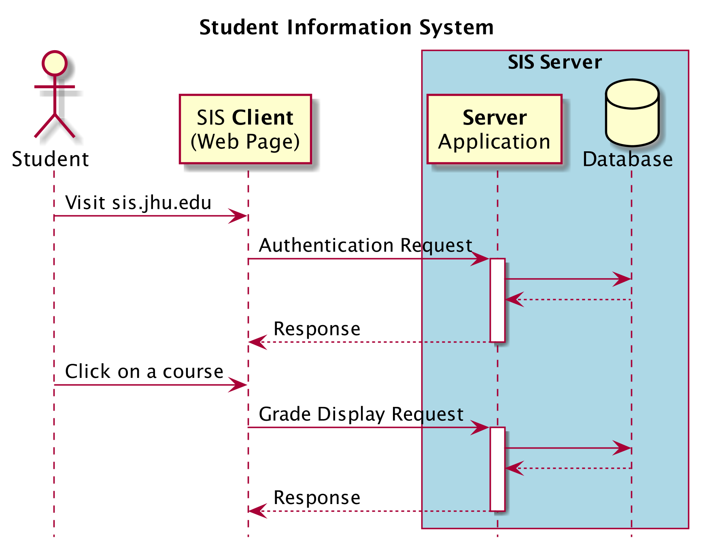

A client-server is a popular **software design architecture** which, at an abstract level, breaks down a software into two parts: client-side and server-side.

* The **client-side** (or simply, client) is the application that runs on the end-user computer; it provides a user-interface (**UI**) that handles what the application feels and looks like and how it interacts with end-user. It may employ and consume resources on the user's machine (computing device) such as temporary and local storage, etc. 

* The **server-side** (or simply, server) is the application that receives requests from the clients, and contains the logic to send the appropriate data back to the client. Instead of user-interface, the server usually has an application programming interface (**API**). Moreover, the server often includes a **database**, which will persistently store all of the data for the application.

As long as your software application adheres to the client-server architecture (i.e. a client can send and receive data to an API on a server) you are free to build whatever user interface you want on whatever platform you want. This is advantageous as modern software application are expected to be available across multiple platforms and provide a consistent experience across devices.

Let’s make all of this a bit more concrete, by following an example of the main steps that happen when a you access your grades on JHU's Student Information System (SIS). 

## An example of Client-Server Application

1. You visit sis.jhu.edu using an internet browser like Chrome on any device that provides internet browsing. 

2. Following your _visit_, a web-page will be displayed in your browser. This web-page is the user-interface of SIS and it constitutes the "client" side of the SIS application. The client application allows you to interact with the SIS server (which, for the intent of this example, may be a physical computer at one of JHU's campuses).

3. On the client-side, you enter your username and password to log into SIS. As this stage, the client application (web-page where you put your username and password) will send (an authentication) **request** to the (SIS) server.

4. Your (authentication) request travels across the internet to the SIS server. The server, which is actively _listening_ for requests from **all users**, receives your request and triggers a **response**. 

5. The response process on the server makes a **database query** to check your login credentials. This database may contain other information about you such as your grades. 
The database query is executed, and the database sends the requested data back to the server. 

6. The server receives the data that it needs from the database, and it is now ready to construct and send its response back to the client (you). In this case, the response would be the _privilege_ to access SIS (assuming your login credential were accredited). 

7. The response travels across the internet, back to your computer. Your browser receives the response and uses that information to create and render the **view** that you ultimately see after successfully logging in. 

:::info "Question"
Can you map the request-response cycle for viewing your grades on SIS, after you have successfully logged in?
:::