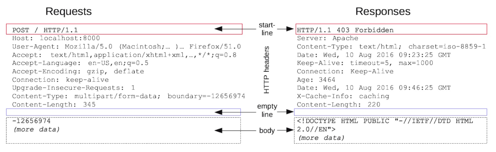

HTTP stands for Hypertext Transfer Protocol and is used to structure requests and responses over the internet.

There are 4 basic HTTP verbs (operation) we use in requests to interact with server:

GET — retrieve a specific resource (by id) or a collection of resources
POST — create a new resource
PUT — update a specific resource (by id)
DELETE — remove a specific resource by id

A HTTP request, in addition to an HTTP verb, typically consists of:

a header, which allows the client to pass along information about the request
a path to a resource
an optional message body containing data

Here is an example of HTTP request and response taken from MDN Docs:

