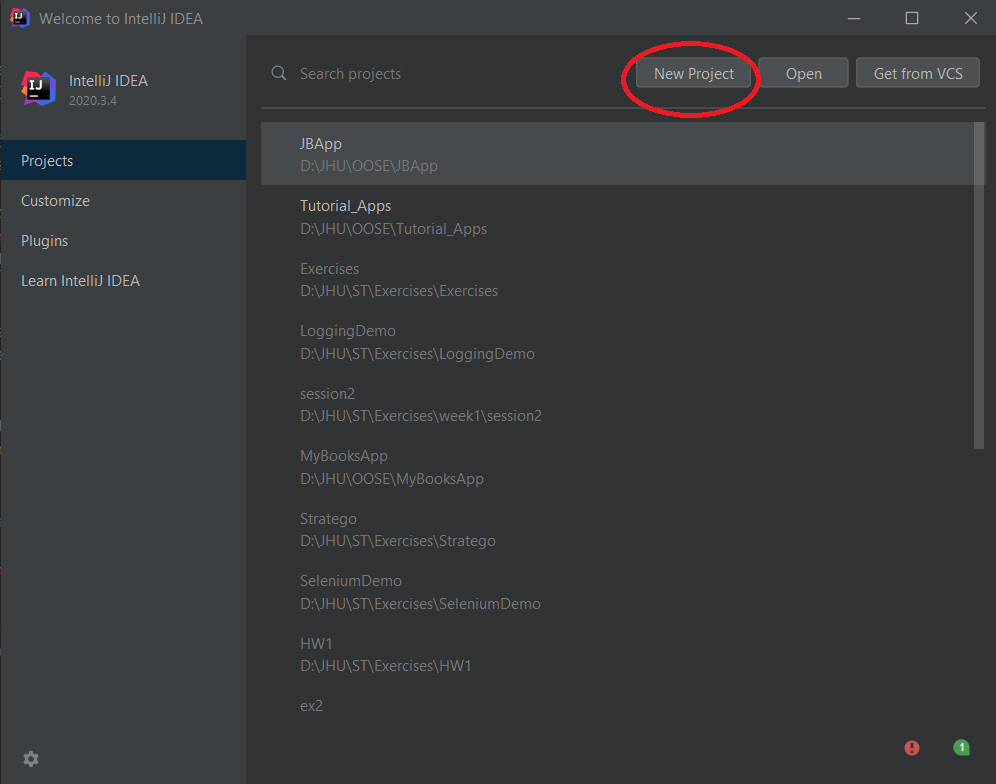
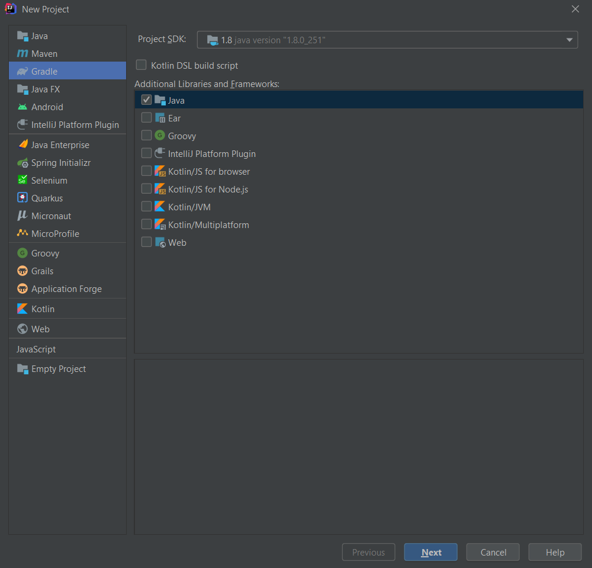
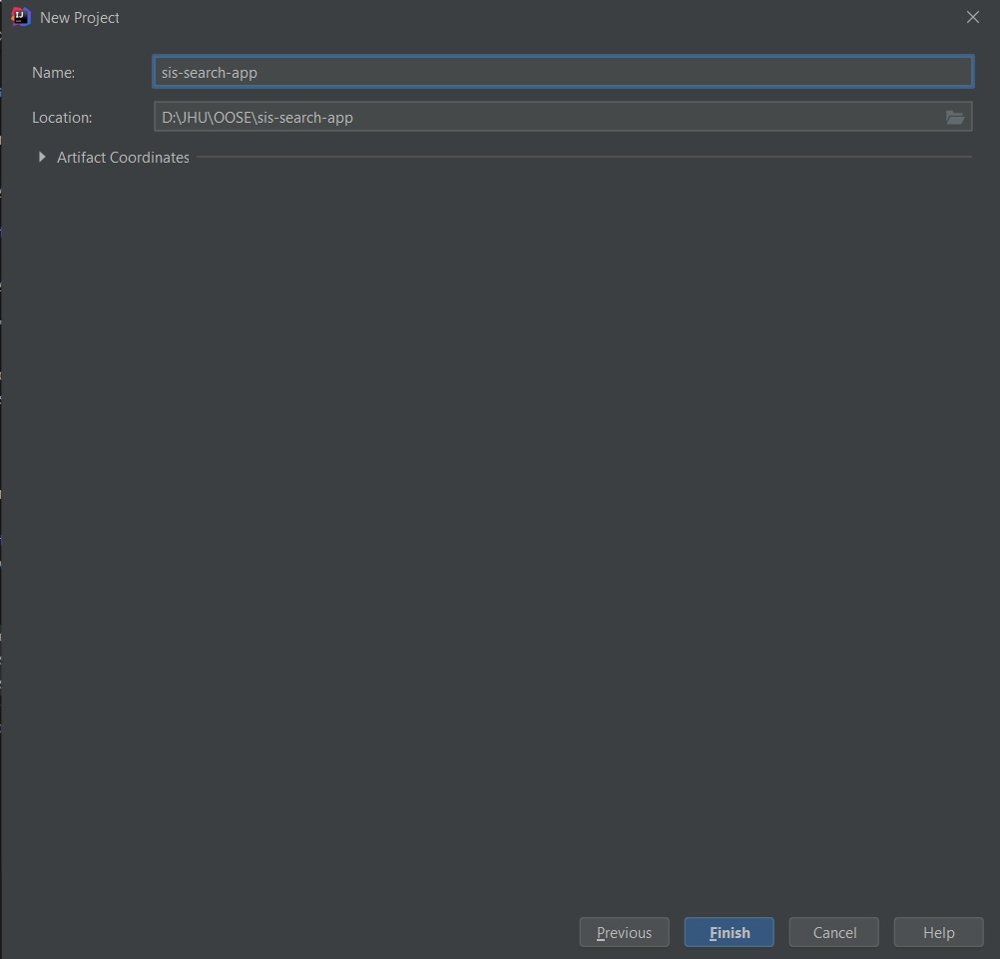

You are free to use any editor/IDE that you want. I recommend JetBrain IDEs. I will be using JetBrain's IntelliJ IDEA (henceforth IntelliJ) to scaffold your homework assignments.

IntelliJ has two versions: a free community edition and a proprietary version which requires purchasing a license, the Ultimate Edition. I recommend downloading the Ultimate edition because as a student you will get it for free!

:::info
You can create a "student account" (with an `.edu` email) to get a license to use the "Ultimate Edition". Click [here](https://www.jetbrains.com/student/) to apply for student license.
:::

Download and install IntelliJ (Version: 2020.3) by following the instructions [here](https://www.jetbrains.com/help/idea/installation-guide.html). I recommend "Install using the Toolbox App." When installing, accept all the default settings.

:::tip
Refer to [this](https://www.jetbrains.com/help/idea/run-for-the-first-time.html) link for a rundown of what you will see when you run IntelliJ for the first time.
:::

## Create a Project

Once IntelliJ is installed, open it and click on "New Project".



Ask IntelliJ to make a Gradle Java project.



Click "Next", name the project `sis-search-app` and "Finish". 



Once the project is created, the editor will open to `build.gradle` file:

```groovy
plugins {
    id 'java'
}

version '1.0-SNAPSHOT'

repositories {
    mavenCentral()
}

dependencies {
    testImplementation 'org.junit.jupiter:junit-jupiter-api:5.6.0'
    testRuntimeOnly 'org.junit.jupiter:junit-jupiter-engine'
}

test {
    useJUnitPlatform()
}
```