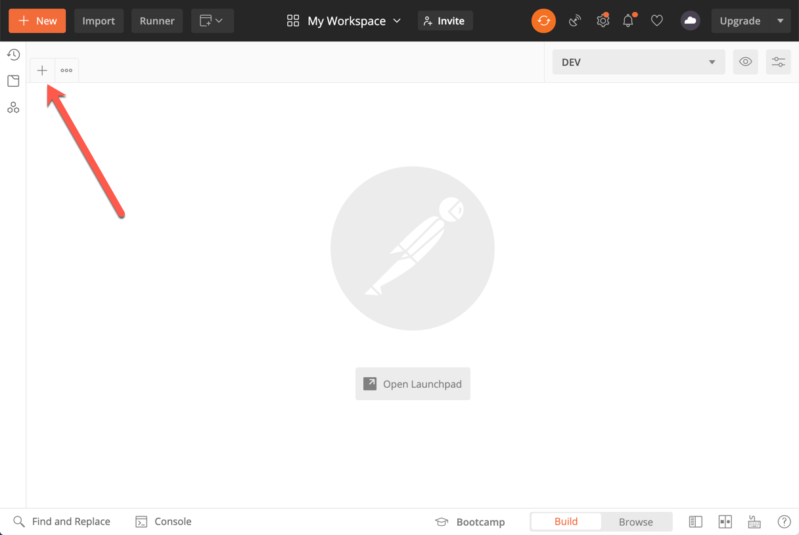
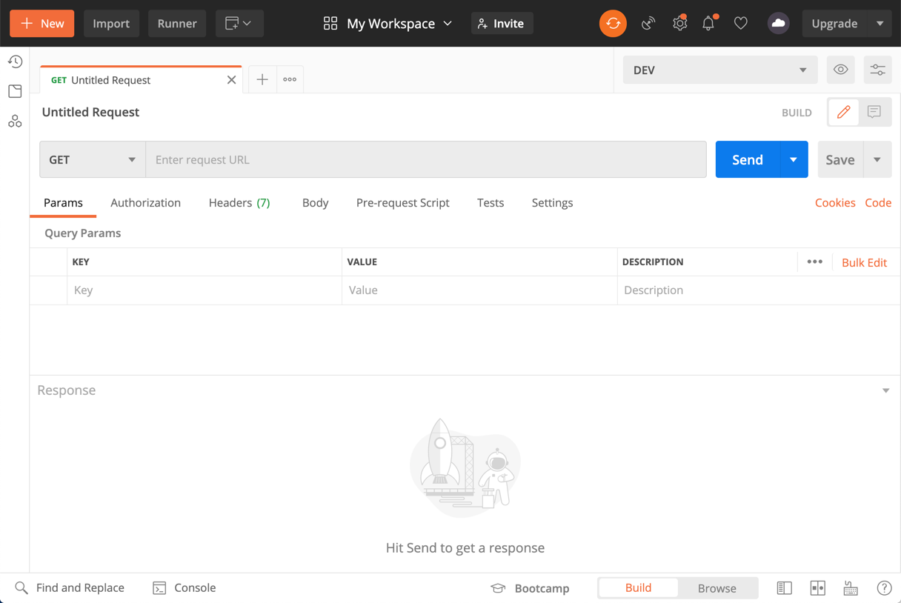
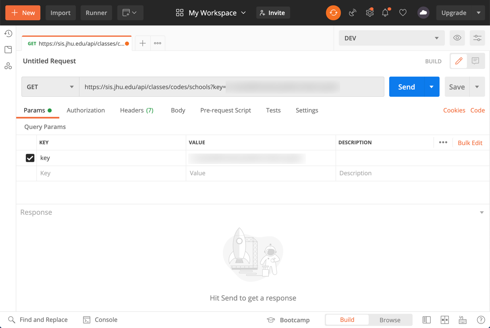
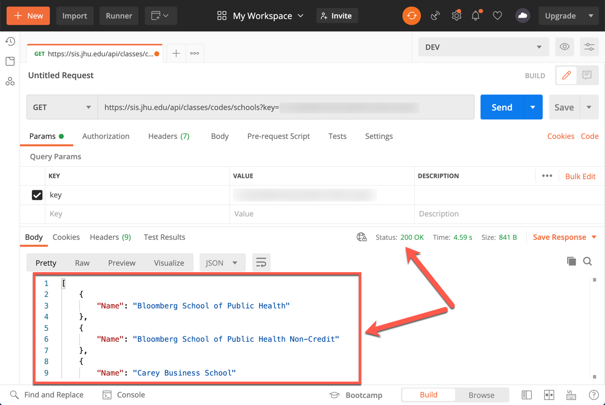

Using browser to send HTTP request (and receive the response) is cumbersome, especially during development. We'll be using a tool called Postman to make requests to our development server. 

:::info
Download and install [Postman](https://www.postman.com/downloads/).
:::


Postman can create GET, PUT, POST, etc. requests complete with bodies. It can also be used to test endpoints automatically. 

:::tip
Postman is an API Development Environment (ADE). Although it was first designed to facilitate performing HTTP requests, it has matured into an industry standard for designing, documenting, testing, and interacting with web APIs.
:::

Visit the [Postman Learning Center](https://learning.postman.com/), in particular, the section about [sending API requests](https://learning.postman.com/docs/postman/sending-api-requests/requests/), for more information and guidelines. 

:::tip
A very good tutorial to get you up and running with Postman is `guru99`'s [postman-tutorial](https://www.guru99.com/postman-tutorial.html).
:::

## Querying SIS

Once installed, open Postman.



Click on the + button to create a new HTTP request.




This is the endpoint to get a list of all available schools

```
https://sis.jhu.edu/api/classes/codes/schools?key=apikeyvalue
```

:::info
Recall the API documentation is available at https://sis.jhu.edu/api.
:::



Click on the "Send" button. It will take a moment and then you will see the "response".




The response is in JSON format.

```json
[
    {
        "Name": "Bloomberg School of Public Health"
    },
    {
        "Name": "Bloomberg School of Public Health Non-Credit"
    },
    {
        "Name": "Carey Business School"
    },
    {
        "Name": "Krieger School of Arts and Sciences"
    },
    {
        "Name": "Krieger School of Arts and Sciences Advanced Academic Programs"
    },
    {
        "Name": "Nitze School of Advanced International Studies"
    },
    {
        "Name": "School of Education"
    },
    {
        "Name": "School of Medicine"
    },
    {
        "Name": "School of Nursing"
    },
    {
        "Name": "The Peabody Institute"
    },
    {
        "Name": "The Peabody Preparatory"
    },
    {
        "Name": "Whiting School of Engineering"
    },
    {
        "Name": "Whiting School of Engineering Programs for Professionals"
    }
]
```

:::tip
JSON stands for JavaScript Object Notation. It is a lightweight format for storing and transporting data, in particular when data is sent from a server to a web page. I recommend watching the (first half of the) following video to learn more about the JSON format. Watch [this video](https://youtu.be/iiADhChRriM) for a quick overview of JSON
:::