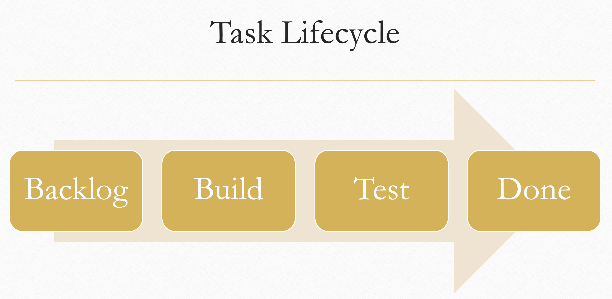

Project Backlog (or Product Backlog) is the current list of User Stories for the Project. 
The User Stories must be organized in groups (e.g. "Must have", "Nice to have", "Out of scope", etc.), and prioritized.

**Assign higher priority to user stories that have the biggest impact and can be done most easily** (See [80/20 rule](https://en.wikipedia.org/wiki/Pareto_principle)). User Stories can be added, modified or removed from the Backlog during the development of your project. 

We already promote prioritization by requiring you to organize your user stories into categories like "must-have" and "nice-to-have". You can further refine these groups by e.g. identifying a subset of must-have as "core requirements" or a subset of your "nice-to-have" as "out-of-scope" or "won't-have" categories. By these refinements, you create a higher "signal-to-noise" ratio which will lead to a more successful product.

:::tip
User Stories can be added, modified or removed from the Backlog during the development of your project.
:::

## Iteration Backlog

Before starting an iteration, you must select a subset of User Stories from the Project Backlog that are planned to be delivered during the iteration. You can further divide each 
User Story into Tasks. The Tasks are the activities performed to deliver a User Story. 

