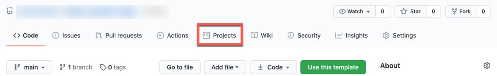
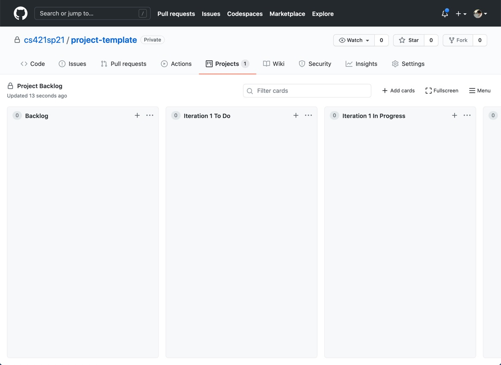

:::tip
If you have not already, read ["user stories"](user_stories) and ["project backlog"](backlog) sections before reading this page!
:::

We will make a GitHub repository for your term project where you shall store your code and collaborate with teammates. Github's project boards feature enables easy tracking of work progress in a repository. Your group is required to set up a project board in your group repository.

*Setup* - On the main page of your group repository, go to the "Projects" tab. You will get an option of creating a new project in the repository. Give it the name "Project Backlog". Make sure to select the "No Template" option since this will give you greater control over your board.

*Structure* - Your project board should have a column "Backlog" followed by 3 columns for each iteration: "To Do", "In Progress", "Done". For example, "Iteration 1 To Do", "Iteration 1 In Progress" and "Iteration 1 Done", and so on. You can create columns with these specific names. The iteration "To Do" column represents the iteration backlog.

*Usage* - Each [user story](user_stories) to be covered acts as a "card" in a column on the board. Then, each user story needs to be broken down into tasks that you will complete. Each task can automatically be linked to an issue in your repository in two ways - [converting notes to issues](https://help.github.com/en/github/managing-your-work-on-github/adding-notes-to-a-project-board#converting-a-note-to-an-issue) and [adding issues and PRs to project boards](https://help.github.com/en/github/managing-your-work-on-github/adding-issues-and-pull-requests-to-a-project-board).

:::caution
For the iteration you are working on, make sure to add detailed subtasks so advisors can clearly see the amount of work you're planning to do.
:::

For future iterations, make sure to have a To Do column. This can be filled with high-level tasks (user stories) you want to work on, for that iteration. This helps you plan out your project over time.

Consult the Github's documentation ["About project boards"](https://help.github.com/en/github/managing-your-work-on-github/about-project-boards) for more information.

:::danger Caution
The state of your GitHub repository, in particular the project-board, will be a factor in your grade for each iteration.
::::