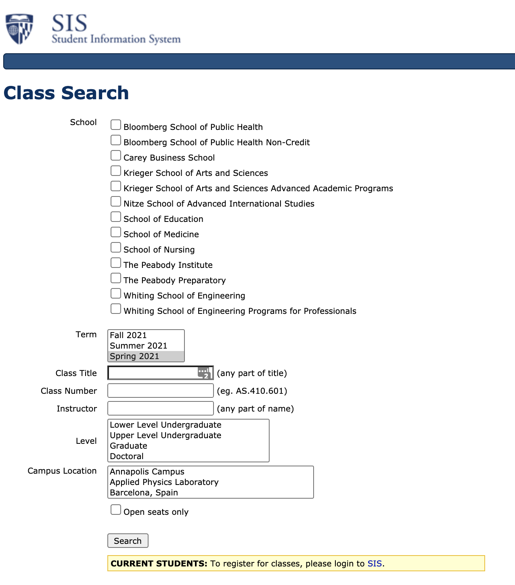
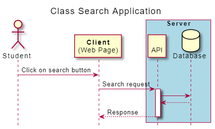

Most software applications that you use adhere to the client-server architecture. To better understand the client-server model, we will trace the request-response cycle for a simple application which all of you have used before: JHU's class search available at https://sis.jhu.edu/classes/.

1. You visit https://sis.jhu.edu/classes/ using an internet browser like Chrome on any device that provides internet browsing.

1. Following your visit, a web-page will be displayed in your browser. This web-page is the user-interface (UI) of the class search application, and it constitutes the "client" side of it. The client application allows you to build a search query by entering several search criteria.

1. On the client-side, you enter your search query and click on the "search" button. At this stage, the client application sends a request (along with your search query) to the class search application server.

1. Your (search) request travels across the internet to the server. The server, which actively listens to requests from all users, receives your request and triggers a response.

1. As part of processing your request, the server makes a database query to look up the classes that match your search. The database query is executed, and the database sends the requested data back to the server.

1. The server receives the data that it needs from the database, and it is now ready to construct and send its response back to the client (you). In this case, the response would contain the classes that match your search.

1. The response travels across the internet, back to your computer. Your browser receives the response and uses that information to create and render the view that you ultimately see as your class search results.

Here is a sequence diagram that summarizes the interaction described above:

