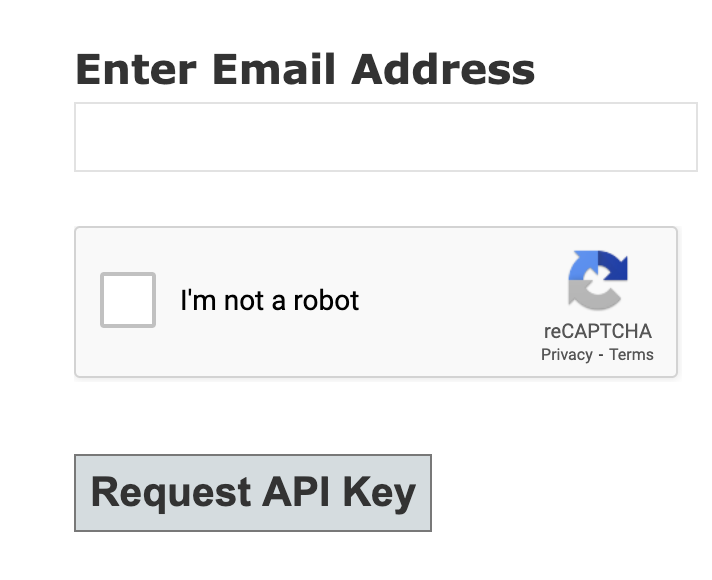

The Class Search application is an example of a client-server architecture. One of the advantages of using this model is that you can easily make multiple clients, all connected to the same server. In fact, JHU has another (smoewhat fancier) course search available at https://e-catalogue.jhu.edu/course-search/.

Another advantage is that you can make your API (or part of it) available to public (or select clients) to build other applications. For example, Hopkins has made its Course Search API publicly available here: https://sis.jhu.edu/api. Applications such as semester.ly make use of this API.

We are going to work with Hopkins' Course Search API as an example of a very simple and basic HTTP compliant API. You must take the following steps:

* Get an Access API Key.
* Download and install Postman.

## Access API Key

Only registered users are permitted to access Course Search API. The registration form is available at https://sis.jhu.edu/api. To register, you must provide a valid email address.



Once you have registered, you will receive an email with the API Key. The Key is a string of characters like this one: (The one here is a fake one!)

```
pJnMRxKD1fFECXFRX1FDXykpLww0Lazk
```