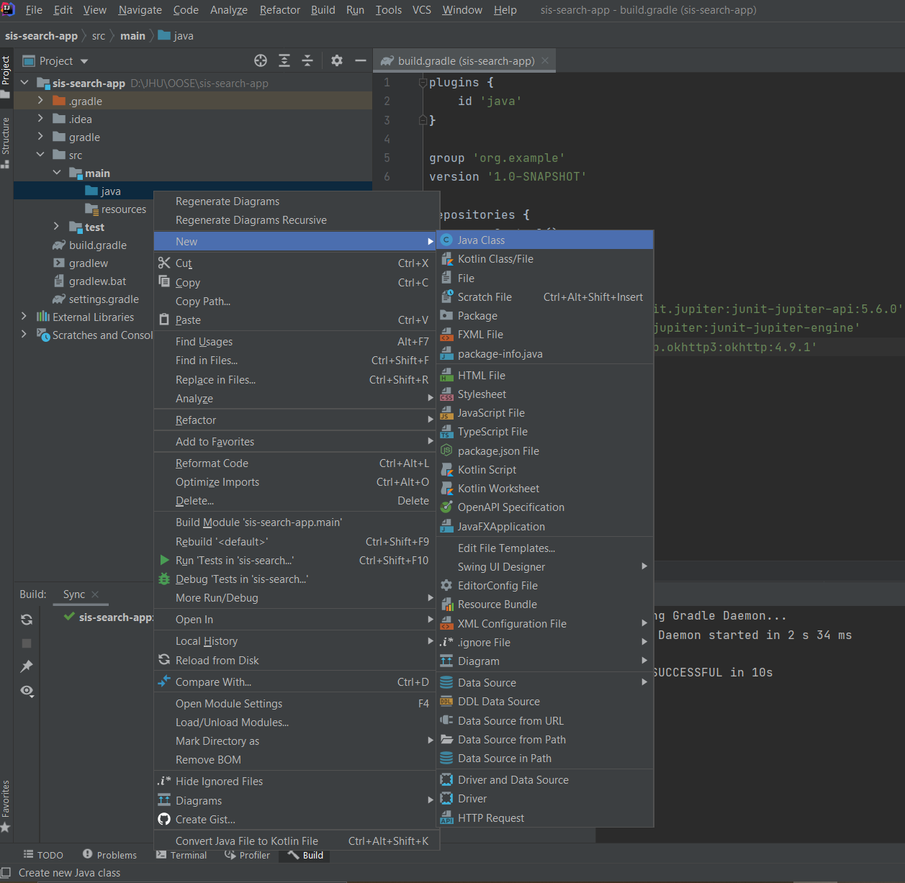
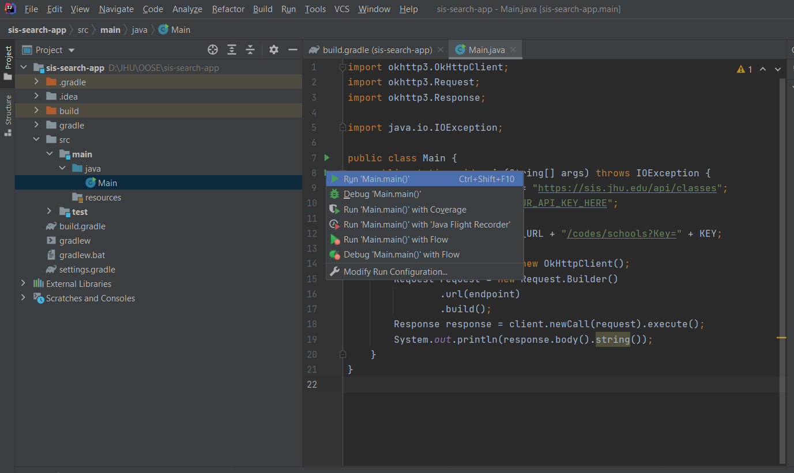
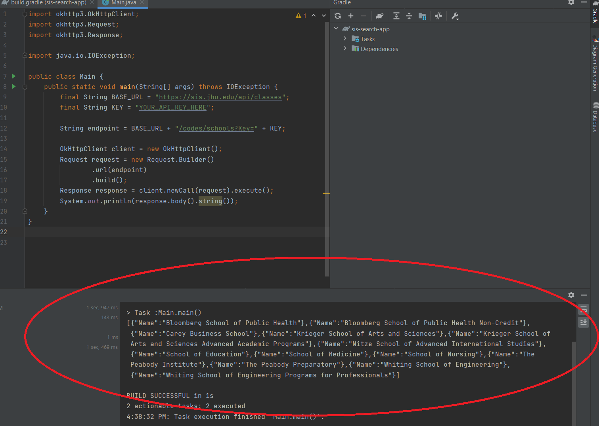

We already discussed how to create a new Gradle Java project named `sis-search-app` [here](Intellij). Inside the project, create a new Java file named `Main.java` as follows:



Type the following in `Main.java`:

```java
import okhttp3.OkHttpClient;
import okhttp3.Request;
import okhttp3.Response;

import java.io.IOException;

public class Main {
    public static void main(String[] args) throws IOException {
        final String BASE_URL = "https://sis.jhu.edu/api/classes";
        final String KEY = "YOUR_API_KEY_HERE";

        String endpoint = BASE_URL + "/codes/schools?Key=" + KEY;

        OkHttpClient client = new OkHttpClient();
        Request request = new Request.Builder()
                .url(endpoint)
                .build();
        Response response = client.newCall(request).execute();
        System.out.println(response.body().string());
    }
}
```

Make sure to replace `"YOUR_API_KEY_HERE"` part with your actual API key. Note how we we instantiate a `client` from `OkHttpClient` class. We typically do this only once! Then we compose a `request` and send it via the instantiated client. Once we compose a request, we `execute` it and collect the response. The response, as discussed, is in JSON format in this case, which we simply print to standard output here.

Next, build and run your code:



If the code runs successfully, it should produce the following output:



