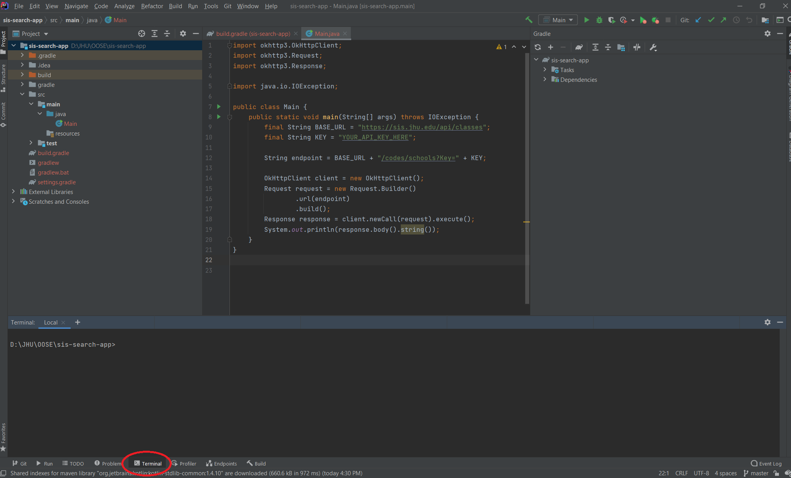

Run the following command in the Intellij terminal while you are in the `sis-search-app` folder:

```
git init
```




:::tip
for the `git` command to work in the terminal, `git` must be installed in your machine and added to your `PATH` environment variable.
:::

Next, run the following command in the terminal.


```
git add .
```

Git now has taken a snapshot of the files in your repository. This is like pressing command + c to make a copy in the memory (but the copy is not completed until you press command + v).1

:::info
In Git's jargon, we say changes are staged to be committed.
:::

You can run `git status` now to see the state of our repository. The files in your project must appear in green color under "changes to be committed".

Next, run the following command in the terminal.


```
git commit -m "Initial Commit"
```

Git now has saved (committed) the snapshot you've created earlier using the add command. This is like pressing command + v (after having pressed command + c to make a copy). Commits are like versions of your repository where you can access at any future point. A commit is part of the history of your repository.

To see a log of your commits, you can run the following command in the terminal.


```
git log
```

The command git log lists the commits made in reverse chronological order. Each commit has a commit ID (a hash identifier), the author's name and email, the date written, and the commit message.

