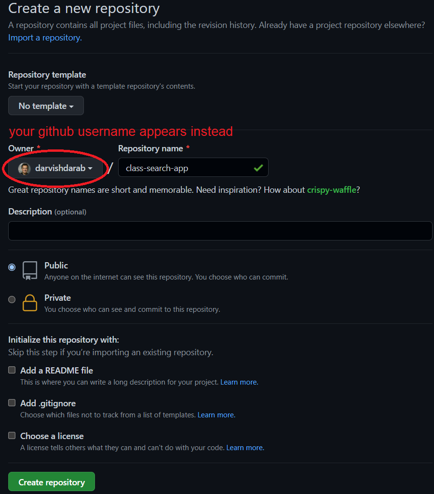
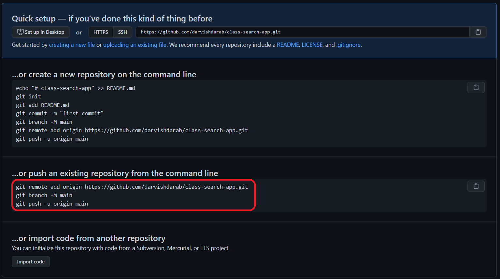

GitHub is a website that stores Git repositories on the internet to facilitate the collaboration that Git allows for. We will be using GitHub in this class. If you don't already have an account, please make one by visiting github.com/join

:::info
If you have NOT already done the "Github form", please [fill it out](https://forms.gle/ZFC8x6QZU62Qoj9e7) to let us know what your GitHub username is. We need it to setup repositories for your homework and project.
:::

Let's put our repository on GitHub for the world to see! Go to GitHub, login, and then create a new repository:



Once the repository is created, GitHub provides a few useful suggestions to start working with it.



Since we already have a local repository, we follow the instructions for "...or push an existing repository from the command line." For the GitHub repository I've created, this is the command I must use (the GitHub repo URL will be different for you). In the Intellij's terminal while you are in `sis-search-app` directory, type:

```
git remote add origin https://github.com/darvishdarab/class-search-app.git
git branch -M main
git push -u origin main
```

:::info
The reposirty's url would be different for you based on your github username
:::

Next, refresh the page on GitHub. You must see the content of class-search-app folder uploaded to your GitHub repository.

In your GitHub repository, you can click on any of the files to open it. There is even a built-in editor.

Moreover, there is a list of all commits (similar to git log but fancier!).

:::tip
Intellij offers a nice integration with Github. In Intellij, we could do all the git operation we did above and in the [previous part](sissearchappgit) using the Intellij's `Git` menu. Even better, we could go to `VCS` menu -> `Import in Version Control` -> `Share project on GitHub` to push our app in one go into Github!
:::
