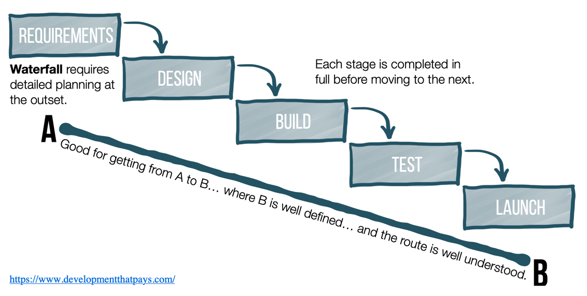
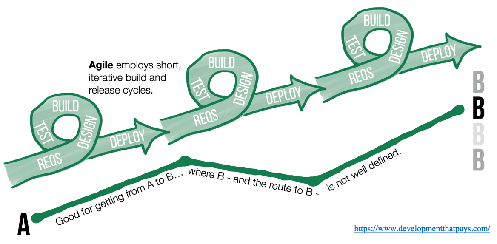

A software process is defined as a set of related activities that leads to the production of a software product. At an abstract level, a software process involves activities related to _specification_, _design_, _development_, _validation_ (testing), and _evolution_ (maintenance) of software. 

:::info
All process models can be categorized as one of the following:
* Plan-driven
* Agile
:::

A **plan-driven** process is one where all of the process activities are planned in advance, and progress is measured against this plan. An example of a plan-driven process is the [Waterfall model](https://en.wikipedia.org/wiki/Waterfall_model).

An **agile process** is one where planning is incremental, and it is easier to change the process in accordance with changing customer requirements.

## To Agile, or not to Agile?!

Agile software development, since its inception at the turn of the (21st) century, took the software industry by a storm and quickly became the most popular (and fashionable) development style. There are many reasons to this but perhaps the most
important is that, in practice, development teams following plan-driven approaches were not able to rapidly and flexibly produce software systems. The plan-driven process could be cumbersome and limiting as requirements are often changing and imperfectly understood at the outset of a software project.[^1]

[^1]: Software development is often considered a **wicked problem**; a problem that must be solved to be understood! [Here](https://blog.codinghorror.com/development-is-inherently-wicked/) is a reflection on software being a wicked problem.

Agile process, on the other hand, is rooted in the **incremental development approach** that entails interleaving the activities of specification, development, and validation. The software is developed as a series of _versions_ or increments, with each version adding functionality to the previous version. The underlying idea in this approach is to develop an initial version of your software, open it to feedback, and then incrementally develop newer versions based on this feedback.

It is beyond the scope of this course to explore this subject in greater details. If you are interested, the Wikipedia article 
on [Agile Software Development](https://en.wikipedia.org/wiki/Agile_software_development) is a great starting point. 

## What is (and isn't) incremental development?

The idea of iterative and incremental development is often miss-understood. 
I recommend viewing the following short video for a better understanding of agile methodology. 

<iframe width="560" height="315" src="https://www.youtube.com/embed/0P7nCmln7PM" frameborder="0" allow="accelerometer; autoplay; encrypted-media; gyroscope; picture-in-picture" allowfullscreen></iframe>

 
 

