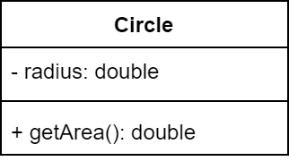

### Class 

In a Class diagram, each class is represented as a box. 
The box contains a class's name.

It can optionally include attributes (data  fields), and operations (methods).  

The name of the class is the only required tag in the graphical representation of a class. It always appears in the top-most compartment.

Attributes appear in the second compartment just below the name-compartment. They are presented as `name: type` and they can be preceded by the following signs to indicate their visibility: `+` (public), `-` (private), `#` (protected), `/` (derived).

Operations appear in the third compartment. They are presented as `method(type): return_type`; you can specify the visibility of an operation in the same way you would for an attribute. 

:::tip
When depicting classes

* *Static* methods and fields are indicated by underlining.
* *Constant* (i.e. final) fields are indicated via naming convention: in ALL_CAPS.
* *Abstract* methods are shown in italics, where permitted by the font in use.
:::

When drawing a class, you don't need to show (all) attributes and operations. Typically, you omit from the box such common operations as constructors, get methods, and set methods.
