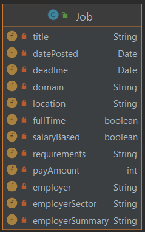
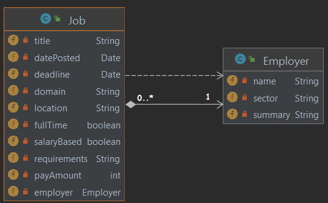

:::tip Principle
Ensure that each class is highly cohesive.
:::

Object-Oriented designers use the word **cohesion** to describe everything in a class is related to its central purpose. It is a measure for how well the internal parts of a class (e.g. the methods and attributes) belong together.

:::info 
A highly cohesive class is one that only comprises responsibilities which belong together. A class ideally has a single responsibility. 
:::

Why does this matter?

* Applications that are easy to change consist of classes that are **easy to reuse**.
* A class that has many responsibilities is difficult to reuse.
* A class that has several responsibilities, has many reasons to change. When it changes, 
    * it may change for a reason that is unrelated to your use of it.
    * there's a possibility of breaking every class that depends on it.

:::info How to figure out if a class is not cohesive?
Here is one strategy: **describe your class in one sentence**.
* if you cannot, it probably has too many responsibilities.
* if your description has "and"/"or" in it, it probably has too many responsibilities.  
:::

:::caution Take home message
A class should do the smallest possible useful thing.
:::

## Example Design

The examples are (partial) designs for the [MyBooks App](../wk1/mybooksapp).

You may have been tempted to move author-related information into the `Book` class since an author has only three data fields, producing the `Book` class below:

But now the `Book` class (arguably) has too many responsibilities. It would have to change if we change, e.g. author information.

On the other hand, separating `Publisher` and `Book` may be an overkill (as far as we are concerned in our little app), since publisher is just a name (i.e. String) that may very well be integrated into (and seen as part of) `Book`. So, the design below is trying too much to increase cohesion.

:::tip
You could certainly think about factoring out more classes from the `Book` class to increase *cohesion* even further (and even add more class fields to those classes for a more thorough modeling/design), but what we have should be good enough for the first pass. Remember, nothing is written on stone; start simple and as you get more user stories in, go back to refine your design. **Do not commit to an unnecessarily complex design upfront; only make your design more sophisticated as the system requirements dictate.**
:::
