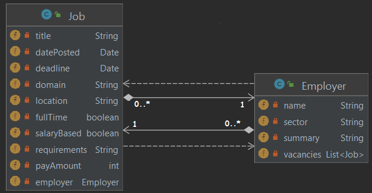

:::tip Principle
Ensure that classes are loosely coupled to one another.
:::

Object-Oriented designers use the word **coupling** to describe the dependency between classes.
When a class _collaborates_ with another class, there is some sort of _dependency_ between them and therefore they are *coupled* to each other.

:::info 
Classes should not interact (collaborate) with too many other classes. Moreover, if a class `A` interacts with another class `B`, this interaction should be **loose**, which means that `A` should **not** *know too much* (or *make too many assumptions*) about `B`.
:::

Why does this matter?

* Applications that are easy to change consist of classes that are **loosely coupled**.
* A class that is *tightly coupled* to other classes, may need to change if those classes change. 
* In a system that is strongly coupled, when a class changes, there's a greater risk of breaking several other classes (that depend on the changed one).


:::info How to figure out if coupling is high?
When you look at the UML Class diagram of your design, every "relationship" is an indication of coupling. The more relationships you have (and the stronger the relationships are)[^1], the higher is the coupling.
:::

Sometimes, coupling does not manifest itself in a UML diagram. This is when, for instance, a class depends on the inner working of another class. This is the strongest (and nastiest) form of coupling.

For example, consider the implementation of getScore inside the Student class:

```java
public class Student {
    private String name;
    private String email;
    private GradeBook grades;


    public double getScore() {
        double quiz = grades.quiz();

        double project = 0;
        for (Double iteration: grades.project()) {
            project += iteration;
        }

        double homework = 0;
        for (Double grade: grades.homework()) {
            homework += grade;
        }

        return 0.1 * quiz + 0.3 * homework + 0.6 * project;
    }
}
```

The getScore method knows a lot about the GradeBook class! If we change anything in the GradeBook class, this method may break down. The Student and the GradeBook are tightly coupled. To reduce the coupling, you can let the GradeBook class to calculate the score:

```java
public class Student {
    private String name;
    private String email;
    private GradeBook grades;

    public double getScore() {
        return grades.totalScore();
    }
}
```
Now the Student class does not need to know anything about what is in the GradeBook class other than it has a totalScore method that it can call to get the student's score!

:::caution Take home message
It may be impossible to eliminate coupling but you should strive to minimize it.
:::

[^1]: Association, for instance, is a stronger indication of coupling than dependency relationship. Within association, composition is stronger compared to aggregation. 

## Example Design

The examples are (partial) designs for the [MyBooks App](../wk1/mybooksapp).

The **bidirectional** association between `Book` and `Author` below is an example of tight coupling; both the `Book` and the `Author` need to know about one another. If we change one, we may have to change the other one.



On the other hand, the example below represents less (tightly) coupled classes. Here, there is still a dependency between `Book` and `Author` but only `Book` knows about `Author`.


