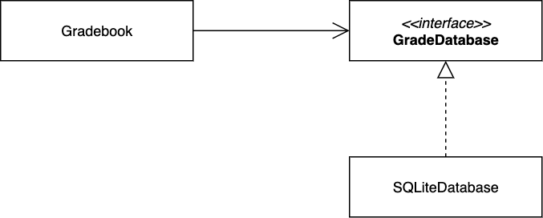
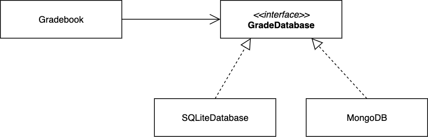

:::info Principle
High-level classes shouldn't have to change because low-level classes change.
:::

First, let's address what are high-level and low-level classes. Let's use a driving analogy. If you were designing a car, the high-level classes would be the parts drivers interact most: steering wheel, accelerator, brake pedal, etc. These components are the first point of entry to the system (kind of like a user interface). The low-level classes would be the components that high-level classes interact with (e.g., tires, engine, brakes) to do their job (fulfill their behavior). What happens to the high-level classes if you change the engine from gas to electric? Ideally, nothing! A driver still steers, accelerates, and brakes using the same functionality. 

Next, let's see an example in code. Suppose you have the following partial class diagram as part of a course management system.

The (high-level) `Gradebook` class depends on (the low-level) `SQLiteDatabase` for reading and persisting its data. This means, any changes to low-level class (`SQLiteDatabase`) may affect the high-level class `Gradebook`, which isn't supposed to care about the data storage details. 

A common fix is to introduce an interface as follows:

As a bonus, this design also allows to extend (add or replace) the persistence mechanism without modifying the high-level class (hence, we also applied the [Open/Closed Principle](ocp.md)).

Notice in the "fix", both the high-level and the low-level classes depend on the interface (an *abstraction*). _The dependency inversion principle does not just change the direction of the dependency; it splits the dependency between the high-level and low-level modules by introducing an abstraction between them._ So in the end, you get two dependencies:

* the high-level module depends on the abstraction, and
* the low-level depends on the same abstraction.

:::info Principle restated!
High-level modules should not depend on low-level modules. Both should depend on **abstractions**.
:::

:::tip Case in point
It is common (and to some extend, natural) that you start developing a software application from the low-level classes (develop the model, persistence, ... before you get to high-level classes like those that comprise the user interface). Therefore, it is imminent to end up with a system where high-level components depend on the low-level ones. This principle suggests changing the direction of this dependency. 