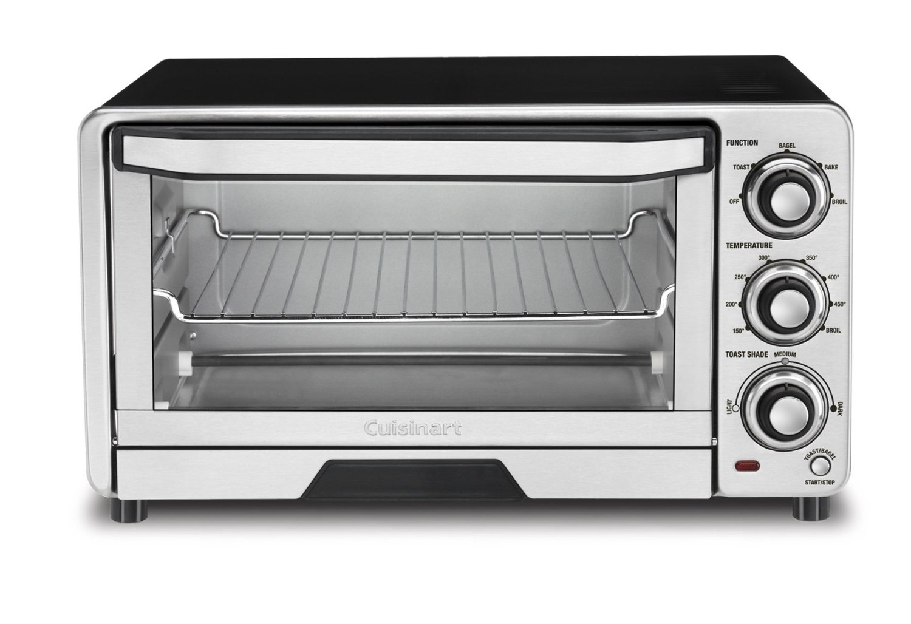

## Encapsulation

_A quick detour_: an oven is an object! There is a lot going on inside an oven but you interact with it through certain set operations. You, for example, can set the temperature of an oven and thus changing its state (temperature). How an oven exactly operates is not your concern. An oven is, in some sense, a black box to you. 

<!-- {: style="height:300px;width:300px"} -->

Objects, in software as in real-life, are build in a way to _encapsulate_ their state and behavior in a 
unit (a bundle, a capsule, a black box, ...) with an **interface** to allow (and simplify) access for the user.

Class is a unit of encapsulation in OOP; it provides the machinery for bundling state and behavior (data fields and methods that work on that data) within one unit. The state is typically _private_ to the object and not (directly) visible to clients. This concept of denying direct access to the state of an object is called **information hiding**. In addition to the state, some of the behavior (responsibilities) of an object may also be hidden and only used by the object. The set of visible (_public_) behavior of an object form its **interface** and define how it _collaborates_ (acts and reacts) with other objects.
