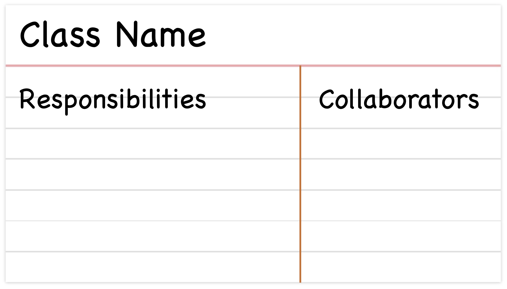
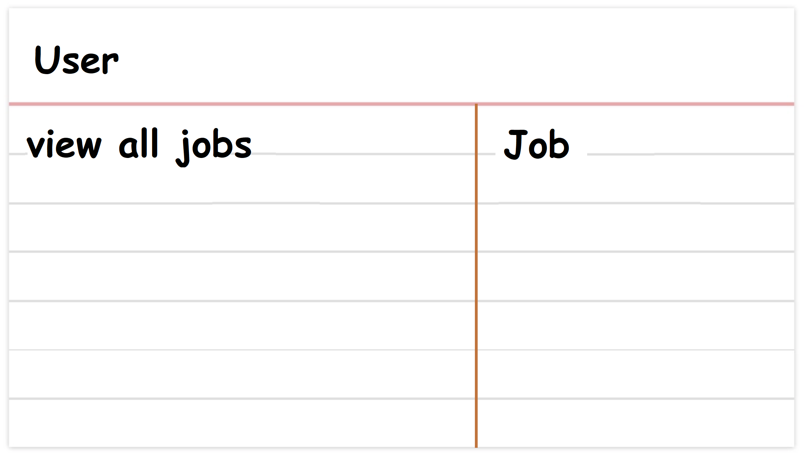

Assume you have selected a few User Stories to implement for the next iteration. Now you need to extract classes from the problem description (User Stories). 
We will use a fairly simple method to address this task, which serves well for most software problems. It involves:

* using the verb/noun method to discover initial classes
* using CRC cards to discover responsibilities (behaviors) of each class and the collaboration (relationships) between them.

## The verb/noun method

Read through a User Story, looking for **nouns** that represent **objects** in the problem domain. These nouns represent the simplest candidates to be classes. Moreover, 
actions that determine classes' behavior often reveal themselves as **verbs** in a User Story. 

For example, consider the following User Story (from [JBApp](../wk1/jbapp)) 

:::note User Story #1
*As a* user, I want to view a complete list of all posted jobs *so that* I can learn about existing vacancies.
:::

The nouns "User" and "Job" are candidate for a class. The verbs "view" (jobs) and "learn" (about vacancies) are candidates for methods i.e., behavior shared among (the nominal) classes. 

The verb/noun method is a gateway to your design but don't follow it religiously! Not all nouns nor all verbs correspond to classes/behaviors. 
You might find later that you need a few additional classes or that some of the classes extracted at this stage are not needed. 

:::info Note
Conventionally, the names of classes are singular rather than plural. This is because the multiplicity is achieved by creating multiple instances of a class.
:::

## The CRC Model

A Class Responsibility Collaborator (CRC) model[^1] is a collection of **standard index cards** that have been divided into three sections, as depicted below. 

[^1]: Beck K., Cunningham W., "A Laboratory For Teaching Object-Oriented Thinking", available at [http://c2.com/doc/oopsla89/paper.html](http://c2.com/doc/oopsla89/paper.html) (1989).

Here is an example of a CRC card for the aforementioned User Story.

A responsibility is something that a class **knows** or **does**. Often a class has to _collaborate_ with other classes to fulfill a responsibility. 
Collaboration usually takes one of two forms: a request for information or a request to do something. 

:::info
CRC model was originally used as a teaching technique but found its way to agile software development arsenal as an effective modeling tool.
:::

### CRC Session

The goal of a CRC session is to discover classes and convert them to CRC cards. It is recommended to do this in a group setting to foster and facilitate brainstorming of good solutions. 

The session involves _iteratively_ performing the following steps:

* Extract classes.
* Find responsibilities.
* Define collaborators.
* Role-play to refine responsibilities/collaborators!

:::info CRC Role-play
Each User Story describes a "scenario" for using the software. A common practice is to "execute a scenario" where each participant plays *the role of a class* and the group collectively simulates the user story. 
:::

:::info 
* A software requirement specification document (SRS) is the initial input to the process. The document should include User Stories. A project that cannot provide SRS is not ready to begin modeling.
* Participants should have read and familiarized themselves with SRS that will be used in the session. 
* A session should focus on a fairly small and manageable portion of the system at a time. Best is to focus on the subset of User Stories that will be implemented in the next iteration. 
:::

The outcome of a CRC session, like that of the verb/noun method, is not carved in stone. When you get to implement the model, new classes will be introduced, responsibilities will be reorganized, existing classes will disappear, and so on.