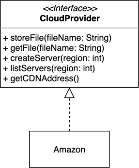
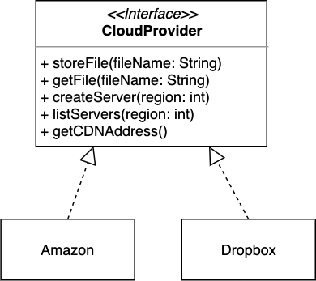
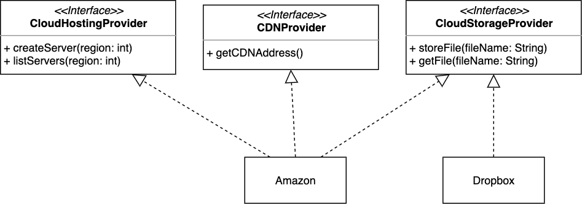

:::info Principle
A class that implements an interface shouldn't be forced to implement methods it does not use.
:::

The Interface Segregation Principle is, in a way, the same as Single Responsibility Principle, only for interfaces. It essentially says: 

:::tip
An interface should describe one set of behaviors. In other words, **keep interfaces small**; break down a "fat" interface into several more refined interfaces.  
:::

Here is an example: imagine your software application integrates with AWS cloud computing provider. You came up with the following design, inspired by the [Open/Closed Principle](ocp.md):

You thought with this design your application is open for extension (when time comes to add another cloud computing provider) and close for modification (since you would not have to mess with the `Amazon` class that implements AWS, your current cloud computing provider). As you have anticipated, in later iterations, you add support for Dropbox to your application. The class diagram then looks like this:

The problem, however, is that Dropbox does not provide the broad spectrum of behaviours declared in your `CloudProvider`. So, if a client calls `getCDNAddress`[^1] on an object of type `Dropbox` for instance, you would have to let them know this feature is not supported by `Dropbox`.[^2] 

[^1]: CDN is short for [Content Delivery Network](https://en.wikipedia.org/wiki/Content_delivery_network).

[^2]: A common approach is to throw [`UnsupportedOperationException`](https://docs.oracle.com/javase/8/docs/api/java/lang/UnsupportedOperationException.html).

A better design would look like the following:

In this example, one bloated interface (`CloudProvider`) is broken down into a set of more granular interfaces (` CloudHostingProvider`, `CDNProvider`, `CloudStorageProvider`). 

Similar to the Single Responsibility Principle, the goal of the Interface Segregation Principle is to reduce the adverse effect of required changes by splitting the software into multiple, independent parts. 

:::tipCase in point
By following this principle, you prevent bloated interfaces that define methods for multiple responsibilities. As explained in the Single Responsibility Principle, you should avoid interfaces with multiple responsibilities because they change often and make your software hard to maintain.