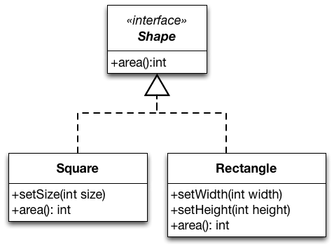

:::info Principle
When extending a class, consider that you should be able to pass objects of the subclass in place of objects of the parent class without breaking the client code.
:::

I've stated this principle informally; if you look it up on [Wikipedia](https://en.wikipedia.org/wiki/Liskov_substitution_principle) for instance, you will find formal descriptions such as

:::caution
Let `ϕ(x)` be a property provable about objects `x` of type `T`. Then `ϕ(y)` should be true for objects `y` of type `S` where `S` is a sub-type of `T`.
:::

All this, is a fancy way of saying that every subclass/derived class should be substitutable for their base/parent class. In other words, a subclass **should not break the expectations** (*code contracts*) set by its super-class.[^1]

[^1]: A closely related principle in software development is called "[Design by contract](https://en.wikipedia.org/wiki/Design_by_contract)". 

Let's see an example to better understand the Liskov Substitution Principle (LSP). Consider the following implementation of `Rectangle` class. 

```java
public class Rectangle {
    private int width;
    private int height;

    public void setWidth(int width) {  this.width = width; }
    public void setHeight(int height) {  this.height = height; }
    public int getArea() { return width*height; }
}
```

Since a square is a rectangle (mathematically speaking), we decide to implement `Square` as a subclass of `Rectangle`. We override `setWidth` and `setHeight` and we can reuse the implementation of `getArea`.

```java
public class Square extends Rectangle {

    @Override
    public void setWidth(int width) {  
        super.setWidth(width); 
        super.setHeight(width);
    }

    @Override
    public void setHeight(int height) {  
        super.setWidth(height); 
        super.setHeight(height);
    }
}
```

:::tip 
With this overriding of `setWidth` and `setHeight` -- to set both dimensions to the same value -- instances of `Square` remain mathematically valid squares. 
:::

The bad news is that making `Square` a subtype of `Rectangle` violates the Liskov Substitution Principle. Here is why:

```java
void clientMethod(Rectangle rect) {
    rect.setWidth(5);
    rect.setHeight(4);
    assert rect.getArea() == 20;
}
```

LSP is violated because if we pass an object of `Square` to `clientMethod` (which we can since `Square` is a subtype of `Rectangle`) the assertion in `clientMethod` will fail. In other words, the expected behavior of super type is not maintained.


So what is the solution? Well, you can simply make two separate classes: `Rectangle` and `Square`.



You could use *composition* to *reuse* the code in `Rectangle`:

```java
public class Square {
    private Rectangle rectangle;

    public void setSideLength(int side) {
        rectangle.setHeight(side);
        rectangle.setWidth(side);
    }

    public int getArea() { return rectangle.getArea(); } 
}
```

:::tip Case in point
* LSP is all about well-designed inheritance. If you cannot substitute your baseclass with a subclass without things going wrong, then it means you used inheritance incorrectly. 
* Inheritance seems like a cool idea; you get to *create a hierarchy of types* and *reuse your code*. But, it’s easy to abuse inheritance. So, don't overdo it; especially consider [composition over inheritance](https://en.wikipedia.org/wiki/Composition_over_inheritance)!


