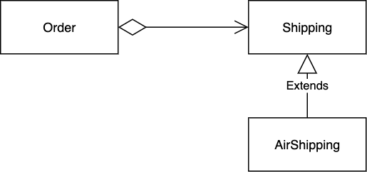
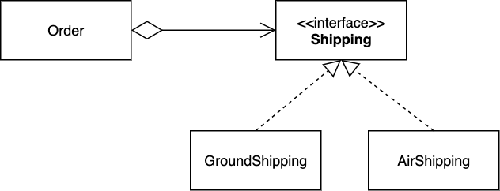

:::info Principle
Classes should be **open** for *extension* but **closed** for *modification*.
:::

What does that mean?! It essentially means **design your application in a way to keep existing code from breaking when you implement new features.**. 

* __Open to extension__ means you can add new features. 
* __Closed to modification__ means the existing code (before adding a new feature) does not have to be modified when you added the new features. 

In other words, **new functionality does not require a rewrite of existing code.** If you aren't modifying the existing code, you know you aren't breaking any of it.[^1]

[^1]: As with the [Single Responsibility Principle](srp), this principle is applied to all software entities (classes, modules, functions, etc.)

Let's be real for a moment: of course you will be modifying your code when you add new feature to your software. The principle says, design the code in a way that any future addition will require small modification of the existing code (so the risk of breaking existing features is minimized). 

Okay! how? Well, one possibility is that all (the bulk of) the new functionality is contained in the newly added class(es). Here is a simple example: suppose you are building an application that involves online shopping with the following partial UML diagram:


Moreover, assume the methods in `Shipping` are implemented for _ground shipping_. Now your business expands to overseas and you want to add a new method of shipping (e.g. Air Shipping). How would you go about updating the software? 

Well, one approach would involve updating the existing `Shipping` class to accommodate the new shipping method. For instance, a `getShippingCost()` cost method would be updated as:

```java
public double getShippingCost(Order order, String shipping) {
    if ("ground".equals(shipping)) {
        // calculate the total cost for Ground shipping
    } else if ("air".equals(shipping)) {
        // calculate the total cost for Air shipping
    }
}
```

This makes for bloated methods, increased complexity and higher risk to break the current functionality of `Shipping` class. The Open/Closed principle suggests to keep the `Shipping` class closed to modification but open to extension. A design that adheres to this principle could use inheritance:



In the above design, the `AirShipping` would _override_ the implementation of `getShippingCost` accordingly. Since you are not changing anything in the `Shipping` class, you will not be breaking any of the features before the "Air shipping" was introduced. 

:::tip Aside
A yet better design would look like this:




<!--- To implement a new shipping method, you can derive a new class from `Shipping` interface without touching any of the `Order` class' code. --->


