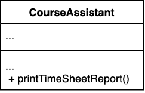
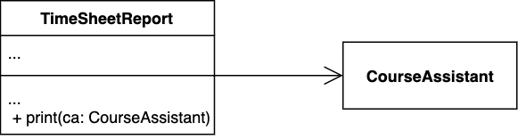

:::info Principle
A class should have one, and only one, reason to change.
:::

The more *responsibilities* a class has, the more reasons it has to change. Every time you make a change, you're risking breaking other parts of the class which you didn't even intend to change. 

This principle goes hand in hand with ["high cohesion"](cohesion) principle:

:::tip 
A highly cohesive class is one that only comprise responsibilities which belong together. A class ideally has a single responsibility.
:::

The single responsibility principle is applicable at many scales: from variables[^1] and methods[^2] to classes to software component and services[^3]. 

[^1]: A variable should mean one thing, and should mean it all of the time; it should not carry different value from a different domain at different times.
[^2]: A method/function/procedure should do one thing (and be good at it!). This is also known as "[Curly's Law: Do One Thing](https://blog.codinghorror.com/curlys-law-do-one-thing/)".
[^3]: The software development technique known as [microservice architecture](https://en.wikipedia.org/wiki/Microservices) can be seen as an application of the Single Responsibility principle at large.

A simple approach to check whether your design conforms to this principle is to ask, for each class, "what is the responsibility of this class?" If your answer includes the word "and," you’re most likely breaking the single responsibility principle. If a class is doing too many different things, create new classes to separate out the responsibilities. 

Let's look at a rudimentary example: suppose you are building a Course Assistant Management System and this is a partial UML of your `CourseAssistant` class:

Among the methods of `CourseAssistant` is the `printTimeSheetReport()`. It could be argued this method (behavior) is a responsibility that can be extracted out of `CourseAssistant` into a separate class:

Now the `CourseAssistant` is only responsible to represent (hold essential data about) a course assistant and `TimeSheetReport` will contain report-related stuff. If you change the reporting format for instance, you will not have to change anything in `CourseAssistant`. 

:::tip 
What is the relationship between cohesion and single responsibility principle (SRP)? Cohesion in a sense is just another name for SRP. If you are writing highly cohesive software, that means you are obeying SRP. Refer to our discussion on ["high cohesion"](cohesion) principle for more examples.
:::