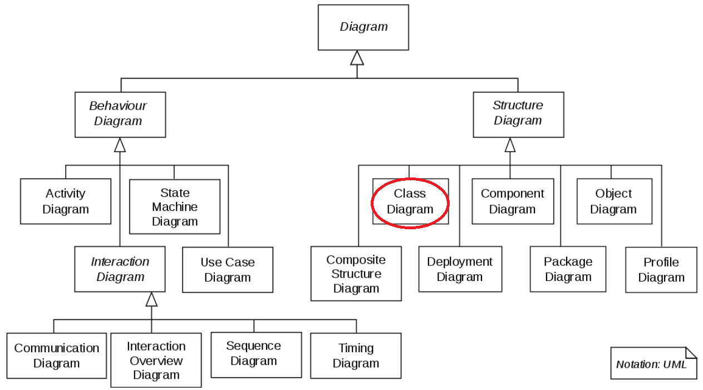

The Unified Modeling Language (UML) has emerged as the standard notation for OOAD. 

UML has many types of diagrams, each aimed to either describe the _structure_ or the _behavior_ of the software system. 
The most commonly used is the **Class** diagram employed to illustrate a software system's necessary **classes and their relationships**.

:::info
You **must** produce a UML Class diagram for your project and _keep it updated at each iteration_. The diagram gives us an overall view of your software system more effectively than either a natural language or a programming language can.
:::

:::info
IntelliJ IDEA **Ultimate** Edition comes with a diagramming utility that can convert your code to UML diagram. You may use this tool if you wish.
:::

:::caution
If you use a tool to automatically generate UML class diagram from your source code, make sure you can read and understand it. We will be using UML for describing _design principles_ in lecture and related design questions on the exam (quiz).
:::

