### Relationships

There are three kinds of relationships in UML Class diagram:

* dependencies
* associations
* generalizations

We use a line (connector) to show a relationship. Different relationships are depicted differently (e.g. dashed vs solid line, arrow vs diamond head, etc.); so, pay attention to the depiction of relationships in the examples that follow. 

#### Dependency Relationships

A dependency shows a class (somehow) _uses_ the other one. 

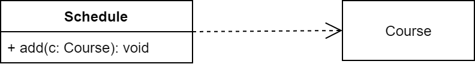

The dependency from `Schedule` to `Course` exists because `Course` is used in the `add` operation of `Schedule`.

A dependency may also indicate a _semantic_ relationship between two classes.

#### Association Relationships

Association is used to model objects that contain other objects. Here a class holds a data field *reference* to the other class. For example, `Course` has a (field of type) `Instructor`:

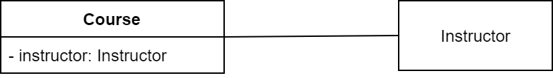

Association represents _has-a_ relationship. It is represented by a (solid) line between two classes.

We can indicate the **multiplicity** of an association by adding *multiplicity adornments* to the line denoting the association. 

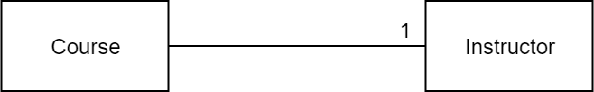

The above example indicates that a `Course` has **one** `Instructor`. 

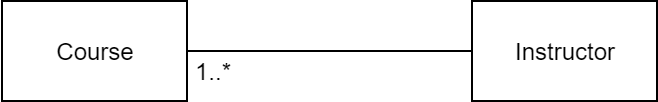

The above example indicates that an `Instructor` is associated with (teaches) **one or more** `Course`. 

We can indicate the the role of an object in an association using **role names**.

We can also **name the association**.

We can specify **more than one association** on a pair of classes.

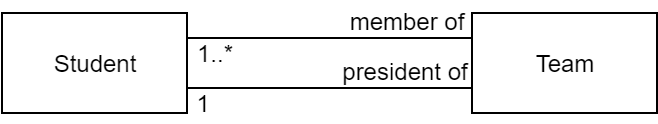

We can constrain the association relationship by defining the **navigability** of the association. 

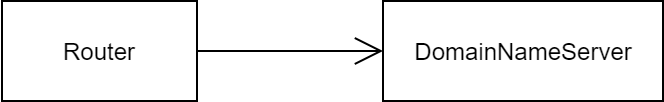

Here, a `Router` object requests services from a `DomainNameServer` object by sending messages to (invoking the operations of) the server. The direction of the association indicates that the server has no knowledge of the Router.

A class can have a **self association**.

<!-- {: style="height:350px;width:350px"} -->
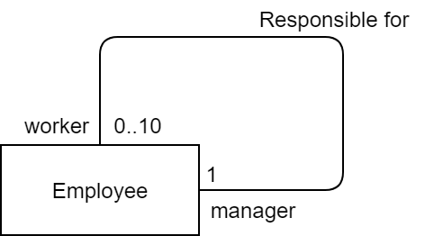

Finally, there are special associations called **aggregations** and **compositions**.

##### Aggregation
An aggregation specifies a **whole-part relationship** between an aggregate (a whole) and a constituent part, where the part can exist independently from the aggregate. Aggregations are denoted by a hollow-diamond adornment on the association.

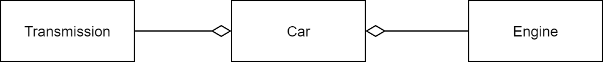

##### Composition
A composition indicates a **strong ownership** and coincident lifetime of parts by the whole (i.e., they live and die as a whole). Compositions are denoted by a filled-diamond adornment on the association.

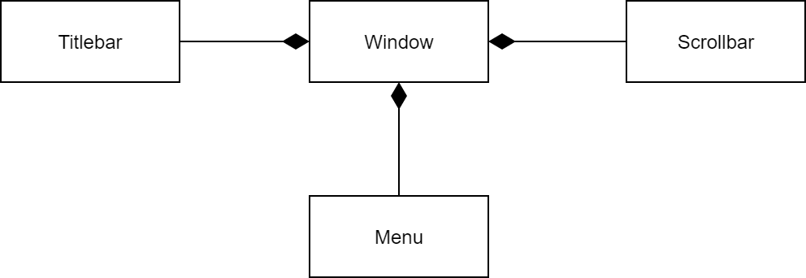

### Generalization Relationships

A generalization specifies "is a kind of" (or simply _is-a_) relationship. It is most commonly used to depict any inheritance hierarchy.

<!-- {: style="height:400px;width:400px"} -->
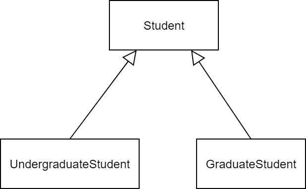

The above example shows that the classes `UndergradStudent`  and `GradStudent` are each derived from the class `Student`.
 
Generalization is represented by an arrow with a hollow head points to the superclass. If a class implements an interface, you draw an arrow having a dotted shaft and hollow head from the class to the interface.

<!-- {: style="height:150px;width:150px"} -->
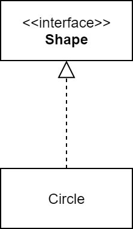

:::info
Abstract classes and interfaces may be shown using the textual annotation `<<abstract>>` and `<<interface>>` above or below their name.
:::

