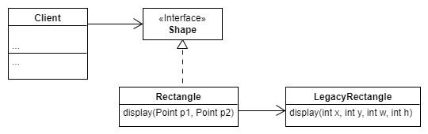

:::info Adapter
__Adapter__ is a _structural_ design pattern that allows allows the interface of an existing class to be used as another interface. Alternatively, it allows objects with _incompatible_ interfaces to collaborate.
:::

Let's explain this pattern using a very simple example. Assume, we have a legacy `Rectangle` class with a public member method named `display()` that expects to receive `x`, `y`, `w`, `h` parameters, where `x` and `y` are the coordinates of the top left of the rectangle and `w` and `h` are the width and height of it. But, there is a client code that uses a `Point` class and wants to pass in two points `p1` and `p2` to the display method. But, obviously, the current implementation of the `display` mehtod that is part of the interface of the `Rectangle` class does not support working with `Point`s. This incongruity can be reconciled by adding an additional level of indirection – i.e. an _Adapter_ object.



The client code now can interact with the new `Rectangle` class (via `Shape` interface) which in turn uses the functionality of the old rectangle class (named `LegacyRectangle` now!)

<!--  -->

```java
public class Rectangle implements Shape {
  private LegacyRectangle lr;

  // ** constructors and other methods omitted! ** 

  @Override
  public void display(Point p1, Point p2) {
    int w = p2.getX() - p1.getX();
    int h = p1.getY() - p1.getY();
    lr.display(p1.getX(), p2.getY(), w, h);
  }

}
```

:::tip
As an aside, also note this pattern follows the [Dependency Inversion Principle](../wk2/dip).
:::

The general idea of an adapter class is similar to adapter in the physical world: think of a mobile charger as an adapter; the mobile battery needs 3 volts to charge but the normal socket produces either 120V (US) or 220V (Europe). So the mobile charger works as an adapter between the mobile charging socket and the wall socket. Another real life example could be a case of card reader which acts as an adapter between memory card and a laptop.

:::info When to use this pattern?
Use the Adapter when you want to use some existing class, but its interface isn't compatible with the rest of your code.
:::

:::tip Advantage
You don't need to change the existing class or the interface. By introducing a new class, which acts as an adapter between the interface and the existing class, you reuse your existing code without changing it. 