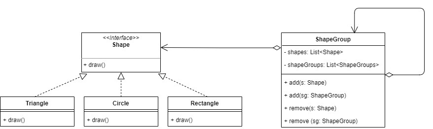
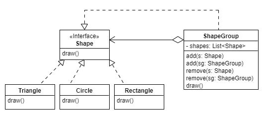
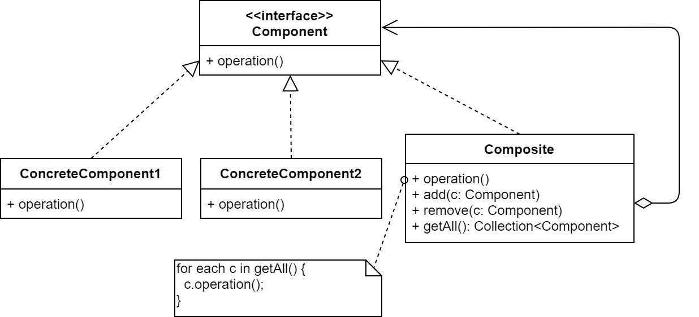

:::info Composite
__Composite__ is a _structural_ design pattern that lets you compose objects into *tree structures* to represent *whole-part hierarchies*. Composite lets clients to treat a group of objects the same way as a single instance of the same type of object. 
:::

## Problem
Graphics applications like drawing editors let users build complex diagrams out of simple components such as line, rectangle, triangle, circle, etc. Assume we intend to design and implement such an application and we like for our drawing editor to support **grouping** and **ungrouping** operations. In other words, the user can group components to form larger components, which in turn can be grouped to form still larger components. 

### A possible solution

A simple design defines classes for graphical primitives such as text and lines plus other classes that act as containers for these primitives:

:::tip Downside of the design
* The code treats primitives (`Circle`, `Rectangle` and `Triangle`) and the container class (`ShapeGroup`) differently, but the user
treats them identically. For instance, the user may want to do some operation (e.g. coloring with `red`) on the shape(s). To the user, coloring single shapes is the same selecting (i.e. grouping) a bunch of shapes and coloring them. Having to distinguish shapes (`Shape`) and group of shapes (`ShapeGroup`) makes the application more complex. The Composite pattern allows use to use recursive _compositio_ so that clients (users) don't have to make this distinction. 
:::

### An alternate solution using Composite pattern

The key to the Composite pattern is an abstract class (or an interface in Java) that represents both primitives and their containers. This means, in our example, to make `ShapeGroup` _implement_ the `Shape` interface. The `ShapeGroup` class provides a means by which several shapes can be grouped together into a single entity which behaves in the same way as a single shape:

But, comes the question how would `ShapeGroup` implement the mandatory `draw` method? The answer is it would call the `draw` method on each shape (or shape group) that is part of the shape group.

:::info
Note that one of the beauties of composite pattern is that it enables nesting. In our example, a shape group can be comprised of single shapes as well as other _nested_ shape groups, which in turn can be comprised of other shapes and/or shape groups. This is possible because both primitive shapes (e.g. `Circle` etc.) and `ShapeGroup` are inheritted from `Shape`.
:::

### Composite pattern

The composite design pattern provides a means of grouping together several objects of type `T` such that the grouped object (i.e. composite object) is also of type `T`.

In the diagram above:

* Component:
    * Declares the abstraction for objects in the composition.
    * Could optionally implement default behavior common to all subclasses.
* Composite:
    * Represents an aggregate object (collection of components).
    * Usually has methods to add/remove component.
    * Typically implements operations of `Component` simply by calling the same operation for each of its constituent components.
* Concrete Component (a.k.a Leaf)
    * Defines behavior for primitive objects in the composition.

:::info When to use this pattern?
- Need to manipulate a hierarchical collection of "primitive" and "aggregate" objects.
- Need to process (treat) primitive objects the same way as aggregate objects.
- Examples: file/folder hierarchies, organizational charts, tables of contents, parsing structured documents like XML/HTML, etc.
:::

:::tip Advantage
Clients typically only need to interact with the `Component` interface; they would be unaware if they're dealing with a composite or a leaf object. This hides the complexity of the data structure from the outside world.
:::
