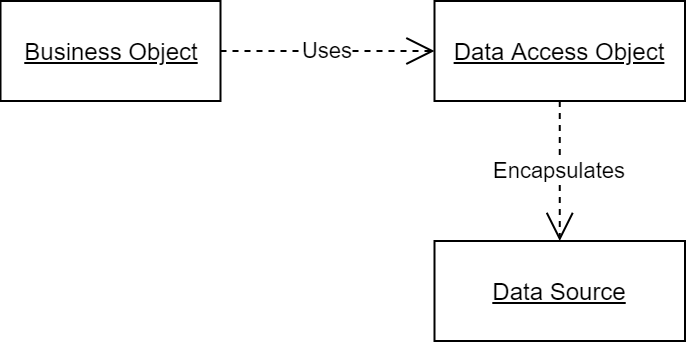
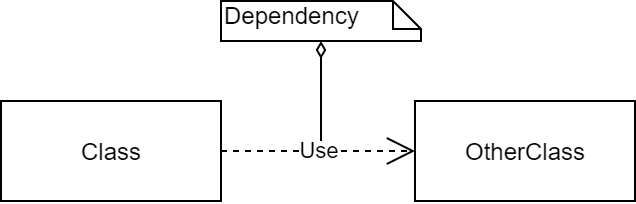
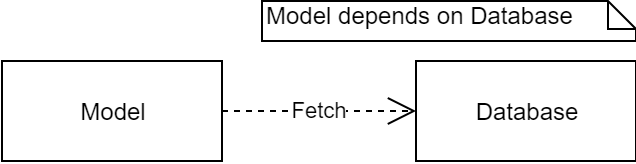
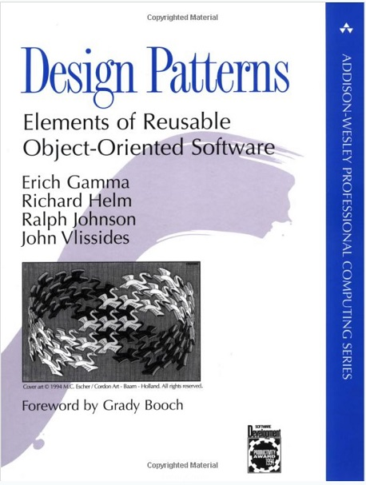

## Where is your _spare_ tire?

What?! ... Well, that question would have made sense if we were going to take a road trip in a car. Notice, although the question may be surprising (when asked in this reading), you do know what I am talking about: _a spare tire is an extra tire you carry in your car in case you are driving and one of the tires goes flat._ Let's take a moment and reflect on this: 

* Problem: when driving a car, a tire might go flat. 
* Solution: change the tire (requires to have an extra tire).
* The problem happens often enough that manufactures, by _design_, equip your car with an extra tire, just in case. 
* The extra tire is called a _spare_.

This is an example of a design pattern! A problem that occurs so often, it is given a name and a known solution. So when I say "where is your spare tire?" (before a road trip) you immediately know what I mean and why I ask for it. 

:::info Design Pattern
A design pattern is a **proven**, **reusable** _solution_ to a **commonly occurring** _problem_. 
:::

There are design patterns in software development, in particular for Object-Oriented design. We will investigate a handful of these patterns in this and the next few readings. 

## Design Patterns we will see shortly in class

In the next few sessions, we will be using some well-know design patterns:

### DAO Design Pattern
DAO design pattern is used to decouple the persistence mechanism and logic into a separate layer. Adding persistence to an application means storing data so that data persists beyond the lifetime of the application execution. It is a very popular pattern when we design systems to work with databases. The idea is to introduce an abstraction between the database (persistence) and the rest of your application.




### Dependency Injection Pattern

A dependency is just another object which your class needs to function. 



For example, a `Model` class that _fetches data_ from `Database` class has a _dependency_ on the `Database` object.



Injecting dependency means the "dependency" is pushed to the class from outside; all that means is that you should not instantiate dependencies (e.g. using the `new` operator) inside of a class. Instead, take it as a constructor parameter (or via a setter method):

```java
public class Model {
    private Database aDatabase;

    public Model(Database db) {
        aDatabase = db;
    }
}
```

Dependency Injection allows the entities in our application to be loosely coupled to one another. In this context, the object that is injected (i.e. gets passed in to the client code) is called _Service_. The code that passes in (injects) the service (aka dependency) is called _Injector_.

:::tip  
The intent behind dependency injection is to achieve separation of concerns of construction and use of objects. This can increase readability and code reuse.
:::


### MVC Pattern
MVC is an architectural pattern that is most commonly used for creating web applications. This pattern promotes separating application's concerns and results in a system design comprised of entities with clear responsibilities.


:::tip
We will see more on `MVC` and `Dependency Injection` later!
:::


## Gang of Four (GoF)



Erich Gamma, Richard Helm, Ralph Johnson, and John Vlissides (collectively known as **Gang of Four**) wrote the book **Design Patterns: Elements of Reusable Object-Oriented Software** in 1994. These authors looked at over 300 projects that other developers were working on:

* They recognized that many of the same problems kept appearing. 
* They also noticed that solution to the problems were roughly the same. 
* Their book discusses these problems and solutions, **identifying each as a _pattern_ and giving it a _name_**.

GoF categorized the patterns into three categories:

* **Creational patterns** - patterns concerned with creating objects.
* **Structural patterns** - aligning classes and objects.
* **Behavioral patterns** - interactions between objects. 

We will look at samples of all three types.

## Why should you learn about design patterns?

First and foremost to write good software: recognizing patterns can help you write code that is easy to maintain in long-term; it helps you avoid writing _hacky_ code.[^1]

[^1]: I define a "hacky" code as one that accomplishes some goal by compromising on design principles that (good) programmers would much rather not compromise on.

:::caution 
The hardest part of applying patterns is being able to recognize it! That is, to identify the problem at hand as the underlying problem of a pattern. 
:::

Another reason is to be able to communicate with other software developers. In a software company, during design sessions and code reviews, developers communicate by using pattern names without giving a full explanation as to what the problem and its solution is. In the same way that I asked you "where is your _spare_ tire?" instead of "Do you have one of those extra tires in case you get a flat? And if yes, where is it?" 