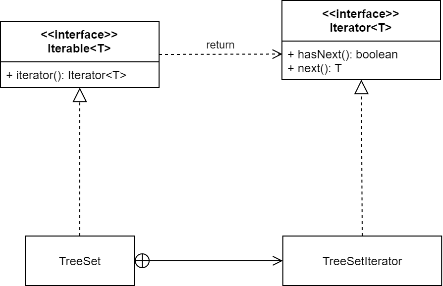

:::info Iterator
**Iterator** is a _behavioral_ design pattern that lets you traverse elements of a collection without exposing its underlying representation (list, stack, tree, etc.).
:::

Iterator pattern is widely used in Java Collection Framework where `Iterator` interface provides methods for traversing through a collection.[^1]

[^1]: If you've taken EN.601.226 Data Structures, you have applied this pattern to (almost) every data structure you have implemented.

For example, consider the following code snippet:

```java hl_lines="7,8,9"
TreeSet<String> set = new TreeSet<String>();
set.add("one");
set.add("two");
set.add("three");
// automatically sorts natural order when adding

for (String s : set) {
    System.out.println(s);
}
// Prints out "one", "three", "two"
```

The enhanced for loop is a _syntax sugar_ for:

```java
Iterator<String> it = set.iterator();
while (it.hasNext()) {
  String s = it.next();
  System.out.println(s);
}
```
The `TreeSet.iterator()` returns an iterator over the elements in ascending order. Iterator pattern is not only about traversing through a collection, but we can also provide different kind of iterators based on our requirements. For instance, if you were interested in getting the `TreeSet` elements in descending order, you could use `TreeSet.descendingIterator()` method. 

In Java, the iterator pattern is applied through implementation of the [`Iterable`](https://docs.oracle.com/javase/8/docs/api/java/lang/Iterable.html) and [`Iterator`](https://docs.oracle.com/javase/8/docs/api/java/util/Iterator.html) interfaces; below is a simplified UML diagram that shows the application of this pattern to [`TreeSet`](https://docs.oracle.com/javase/8/docs/api/java/util/TreeSet.html) class:



Typically, the iterator algorithm is implemented in a separate class.[^2] This separation is following the Single Responsibility principle.

[^2]: The separate iterator class is often placed as an [inner class](https://docs.oracle.com/javase/tutorial/java/javaOO/nested.html) inside the data structure class itself.

The use of `Iterable` (as a separate interface with just one method) is in line with the Interface Segregation Principle. Moreover, the use of `Iterator` interface is in accordance to the Open/Closed principle; you can implement new types of iterators and pass them to existing code without breaking anything. 

:::info When to use this pattern?
Use the Iterator pattern when your collection has a complex data structure under the hood, but you want to hide its complexity from clients  (either for convenience or security reasons).
:::

:::tip Advantage
Iterator pattern hides the actual implementation of traversal through the collection and client programs just use iterator methods.
:::
