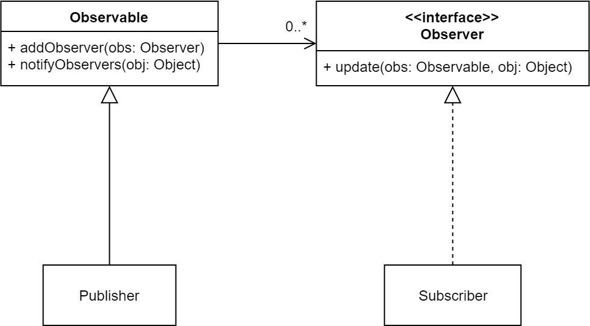

:::info Observer
**Observer** is a _behavioral_ design pattern that lets you define a _subscription_ mechanism to notify multiple objects about any _events_ that happen to the object they're "observing."
:::

Given the COVID-19 crisis, this example seems relevant: suppose you are interested in purchasing "disinfecting wipes" but it is out of stock. You would want to keep an eye out for when it becomes available again; you may routinely check the stocks (by visiting your local store or your favorite online shopping website). This will require a significant time, commitment and effort on your side. A better strategy is to _subscribe_ (if that option is available) to your provider subscription service and ask to be _notified_ when the item of interest becomes in-stock.

:::caution 
Observer design pattern is also called as publish-subscribe pattern. It allows you get _notified_ whenever there is a change in the _state_ of an object you are interested in. 
:::

In observer pattern, the object that watches on the state of another object is called **Observer** and the object that is being watched is called **Subject**. 

:::tip
In the example above, you (i.e., the customer) is the *observer* aka subscriber. The store, which is the object that offers some interesting state to its observers/subscribers, is the *subject* aka publisher.
:::

This pattern is widely applied to Graphical User Interface (GUI) components through [Action/Event Listener](https://docs.oracle.com/javase/tutorial/uiswing/events/intro.html). The idea is to consider each GUI component a _subject_ where different _events_ (e.g. clicking on) would send a notification to an observer class (typically called an Event Listener) which would perform different _actions_ based on the occurrence of an event.[^1]

:::info GUI Button Example
Let's take the exampe of a button in a GUI that supports different actions such as right-clicking, drag/drop etc. The button itself is the subject (aka publisher) and the class(es) that implement functionality for those action events are observers (aka subscribers). The action events (e.g. right-clicking on the button) is the state of interest for which the observer(s) have subscribed.
:::

[^1]: Java's [`EventListener`](https://docs.oracle.com/javase/8/docs/api/java/util/EventListener.html) in [Swing](https://docs.oracle.com/javase/8/docs/technotes/guides/swing/index.html) implements the Observer pattern.

Java facilitates implementing Observer pattern through [`Observable` class](https://docs.oracle.com/javase/8/docs/api/java/util/Observer.html) and [`Observer` interface](https://docs.oracle.com/javase/8/docs/api/java/util/Observable.html).[^2] The _subject_ class must _extend_ `Observable` and observers must implement `Observer`. Here is a simplified UML diagram that represents the Observer pattern in Java:

[^2]: The `Observable` class and the `Observer` interface [have been **deprecated** in Java 9](https://bugs.openjdk.java.net/browse/JDK-8154801). This does not mean the Observer Pattern is depreciated! The pattern is extremely useful. The implementation of the pattern in Java, however, was not ideal (lack of thread safety, not Serializable, limited event model, ...). So, as a Java developer you may want to consider implementing the pattern yourself or using other mechanisims in Java (e.g. `java.beans`) for a notification model. For more info, see [this](https://stackoverflow.com/questions/46380073/observer-is-deprecated-in-java-9-what-should-we-use-instead-of-it) stackoverflow thread.

The use of `Observer` (as a separate interface with just one method) is in line with the Interface Segregation Principle. Moreover, it is in accordance to the Open/Closed principle; you can add multiple new types of observes and add them to subject (observable) without minimized risk of breaking the application. 

:::info When to use this pattern?
Use the Observer pattern when changes to the state of one object may require changing other objects, and the actual set of objects is unknown beforehand (or changes dynamically).
:::

:::tip Advantage
Observers are _loosely coupled_ to subject since the Subject knows nothing about them, other than that they implement the `Observer` interface.
:::
    