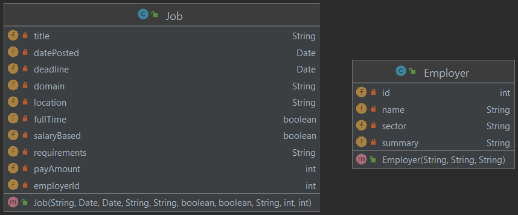

Since we have two separate (model) yet inter-related classes, we need to somehow tie the two together. We can acheive this by either making a reference to the `Employer` class from the `Job` class or keep a list of vacancies in `Employer`. Let us go with first one since in real world there may be so many job vacancies in a single company.

So far, we have had a field named `employer` of type `Employer` in the `Job` class. But, these are POJO classes that are going to be mapped to a database. In order to facitilate this mapping, let us replace that with another field named `employerId` that will be used to reference a specific employer. In particular, `employerId` in `Job` will reference the `id` in class `Employer`. This results in the following `Job` and `Employer` classes.



:::tip POJO
POJO is short for Plain Old Java Object; it's a cute way of referring to simple classes like Book and Author that are free of any special restriction or requirement that might be imposed by using a third-part library or a framework. The term was coined by Martin Fowler, Rebecca Parsons and Josh MacKenzie in September 2000:
"We wondered why people were so against using regular objects in their systems and concluded that it was because simple objects lacked a fancy name. So we gave them one, and it's caught on very nicely."
:::

## In terms of Table Relations

Great! Now that we have our POJO classes in place, we need to map them into our SQLite database. With the current design we have, we need two tables named `Jobs` and `Employers` where there is a one-to-one relationship between `Jobs` and `Employers` tables. The only question is how do we connect these two tables? This leads us to concept of _Foreign Key_.

:::info Foregin Key
A foreign key is a column or group of columns in a relational database table that provides a link between two tables. A foreign key creates an _inclusion dependency constraint_, which in simple terms means the values of the foreign key attributes stored in the referencing table[^2] must exist in the referenced table.[^3]
:::

[^2]: In this context, the referencing table (i.e. the table that contains the foreign key constraint) is usually called the child table and the referenced table is called the parent table.
[^3]: It is out of the scope of this class to go into details of foreign keys and different kinds of relationships among entities (i.e. tables). All you need to know is that a foreign key creates an explicit constraints among two tables such that: 1) all foreign key values stored in the child table must exist in the parent table, and 2) you can control what will happen to the records (i.e., rows) in the child table if we update or remove a referenced value(s) from the parent table.


Now, let us (re)create our `Employers` table:

```sql
CREATE TABLE IF NOT EXISTS Employers (id INTEGER PRIMARY KEY, name VARCHAR(100) NOT NULL UNIQUE, 
                                     sector VARCHAR(100), summary VARCHAR(10000));
```
Next, we create the `Jobs` table with a foreign key constraint:

```sql
CREATE TABLE IF NOT EXISTS Jobs (id INTEGER PRIMARY KEY, title VARCHAR(200) NOT NULL," +
        "date real NOT NULL, deadline real , location VARCHAR(200) NOT NULL, " +
        "fullTime INTEGER, salaryBased INTEGER, requirements VARCHAR(10000), " +
        "payAmount INTEGER, employerId INTEGER, FOREIGN KEY(employerId) REFERENCES Employers(id) " +
        "ON UPDATE CASCADE ON DELETE CASCADE);
```

Pay attention to the last two lines in particular. <mark>FOREIGN KEY(employerId) REFERENCES Employers(id)</mark> states that `employerId` attribute in the current table (i.e., `Jobs`) references the `id` column in the `Employers` table. In (relational) database terminology, the `Employers` table is called the _parent_ table and `Jobs` is the child _table_. 

The last line decides what will happen to a row (or set of rows) in the `Jobs` table with a particular foreign key value (i.e., a particular `employerId` value) if we update or delete that `id` value in the `Employers` table. <mark>ON UPDATE CASCADE</mark> means if a particular `id` value in the `Employers` table is updated, the value is updated for all corresponding rows in the `Jobs` table too. Similarly, <mark>ON DELETE CASCADE</mark> means associated jobs in the `Jobs` table will be deleted "on delete" of any particular `id` value in the `Employers` table.

Once the tables are created, we are ready to implement create, read, update, and delete (CRUD) operations for each of `Employer` and `Job` entities.

<!---
## Takeaway 

It is considered a **design pattern** to provide an abstraction between data persistence and the rest of the application. We have done this (to a good extend) by extracting the persistence procedure from the `Book` class into `GsonBookPersister`. Next, we will start using `SQLite` database to store our data.

-->