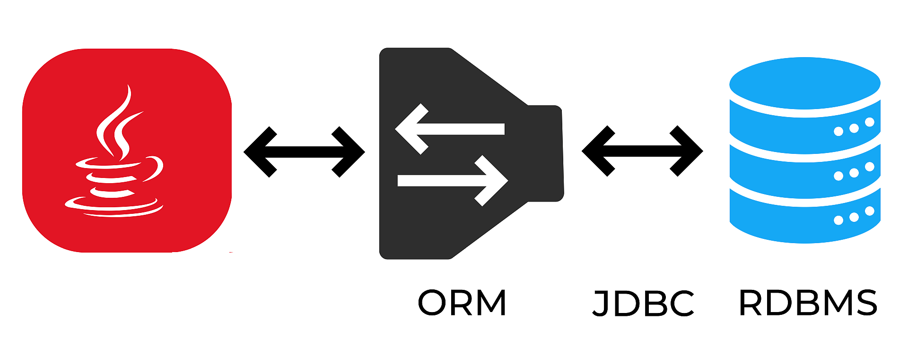

Object-relational mapping (ORM) is an application (library) to map your objects to a relational database; typically, you describe which classes and properties in the code map to which tables and columns in the database, and then the library does all the copying and translating. In this scenario, ORM sits between JDBC and the rest of your Java application.




## ORMLite

[ORMLite](https://ormlite.com/) is a small java library, with the purpose of making database interaction easy. ORMLite provides lightweight functionality for persisting Java objects to SQL databases. To use it, you must add it as a dependency to your project. Open `gradle.build` and add the following line to the `dependencies` block.

```groovy
implementation 'com.j256.ormlite:ormlite-jdbc:5.6'
```

## ORMLite Annotations

:::tip
Annotations are special code markers have have been available in Java since version 5 that provide meta information about classes, methods, or fields
:::

First step is to *annotate* the POJO model classes that you want to be persisted in the database. Let's annotate the `Employer` class with ORMLite annotations as follows:

```java
package model;

import com.j256.ormlite.field.DatabaseField;
import com.j256.ormlite.table.DatabaseTable;

@DatabaseTable(tableName = "employers")
public class Employer {
    @DatabaseField(id = true)
    private Integer id;
    @DatabaseField(canBeNull = true, unique = true)
    private String name;
    @DatabaseField
    private String sector;
    @DatabaseField
    private String summary;

    public Employer() {
    }

    public Employer(String name, String sector, String summary) {
        this.name = name;
        this.sector = sector;
        this.summary = summary;
    }

    public Integer getId() {
        return id;
    }

    public String getName() {
        return name;
    }

    public String getSector() {
        return sector;
    }

    public String getSummary() {
        return summary;
    }
}
```

`@DatabaseTable(tableName = "employers")` specifies that objects of `Employer` class are going to be mapped/saved to a table named `employers`. Each class field that we want corresponded/saved as a column in the target table needs to be annotated using `@DatabaseField`. The `id` argument passed to the `DatabaseField` annotation marks a particular class field as the id (i.e. primary key) of the table. In our case, class field named `id` is the primary key in the `employers` table. `canBeNull` and `unique` arguments are self-explanatory!

:::caution
In order for ORMLite to return the results of your queries properly make sure to always include an explicit default constructor in your class.
:::

## Basic Database Operations

Once you have your model class(es) properly annotated, you can delegate many of the basic database tasks (i.e., CRUD tasks) to ORMLite without writing any SQLs really! That is pretty cool, isn't it? 

### Create & READ

Remember we did the following to create `employers` table:

```java
final String URI = "jdbc:sqlite:./JBApp.db";
Connection conn = DriverManager.getConnection(URI);
Statement st = conn.createStatement();
Statement st = conn.createStatement();
String sql = "CREATE TABLE IF NOT EXISTS employers (id INTEGER PRIMARY KEY, 
       name VARCHAR(100) NOT NULL UNIQUE, sector VARCHAR(100), summary VARCHAR(10000));";
st.execute(sql);
sql = "INSERT INTO employers(id, name, sector, summary)" +
                "VALUES (NULL, 'Nestle', 'Food/Drink', '');";
st.execute(sql);
```

But, having `Employer` class ORMLite-annotated, you can achieve the same by:

```java
final String URI = "jdbc:sqlite:./JBApp.db";
ConnectionSource connectionSource = new JdbcConnectionSource(URI);
Dao<Employer,Integer> employerDao = DaoManager.createDao(connectionSource, Employer.class);
TableUtils.createTableIfNotExists(connectionSource, Employer.class);
Employer em = new Employer ("Nestle2", "Food/Drink", "");
employerDao.create(em);
```

First we create a database connection by passing the connection URI into `JdbcConnectionSource`. Next, we need to create a DAO object. For this, you need to provide the connection instance (i.e., `connectionSource`) as well as the (model) class that corresponds to the DAO we are creating to the `createDao` method of `DaoManager`. This creates a `Dao<Employer, Integer>` object for class `Employer` where `Integer` must corresponds to the datatype of the `id` field in the persisted class (i.e., `Employer` class). Using `TableUtils.createTableIfNotExists` we create the `employers` table if it does not exist already! Next, `employerDao.create(em);` results in execution of the following query on the `employers` table:

```sql
INSERT INTO employers (id, name, sector, summary) VALUES (NULL, 'Nestle', 'Food/Drink', '');
```

Now, using the same `employerDao` object we already created, we can read all the records in the `employers` table (and print their names) as follows: i.e., ```SELECT * FROM employer```

```
employerDao.create(em);
List<Employer> ls  = employerDao.queryForAll();

for (Employer e: ls) {
    System.out.println(e.getName());
}
```

There are other methods such as `queryForEq()` which you can call to read only select records. The following is equivalent of `SELECT * FROM employers WHERE name='Nestle'`:

```java
employerDao.queryForEq("name", "Nestle");
```

:::tip More Operations
ORMLite provides various classes and functionalities to do all sorts of database operations with minimal effort. Consult [this page](https://ormlite.com/javadoc/ormlite-core/doc-files/ormlite.html) for further information.
:::


:::caution
There are specific annotations to specify and work with foreign keys. These would be useful when setting up the `jobs` table in the context of `JBApp`. I trust you can find out those on your own by consulting the documentation page of ORMLite!
:::

