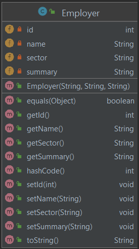

So far, we set up and connected to our SQLite database, and know we need to communicate with it via SQL statements from our Java application. How can we use this arrangement to persist our application's data?

As noted, relational databases, like SQLite, are structured around tables (similar to those in a document or spreadsheet). Each class in your Java application maps to a different table. The class name maps to the table name. Each property of the class (fields) map to a column in that table. Each object instance corresponds to a row in that table; it holds the values that describe a particular entry.

:::info
In relational databases, we expect each record (row in a table) to be unique. If there is an attribute (column) that can uniquely identify each record, then we are good! That attribute can be identified as the **primary key** for that table.[^1] If a table does not have a primary key, you must make one for it by assigning a unique identifier to each row. Usually, this is as simple as having a column that contains a number that increments every time you create a new record.
:::

[^1]: A primary key for a table could be a combination of several columns. This is called _composite_ primary key.

In SQLite, you get a primary key for free, called `ROWID`. This is in every SQLite table whether you ask for it or not. ROWID is assigned a value whenever you `INSERT` a row. If you include a column of type `INTEGER PRIMARY KEY`, that column points at (is an alias for) the automatic `ROWID` column.

## Employers Table

When creating a table in SQLite, we can create a _primary key_ `id` field for it as follows:

```sql
CREATE TABLE IF NOT EXISTS Employers (id INTEGER PRIMARY KEY,
                     name VARCHAR(100) NOT NULL UNIQUE, sector VARCHAR(100), summary VARCHAR(10000));
```

Accordingly, we must update the `Employer` class to include an `id` field.



Note that we do not provide the `id` for `Employer` (when we construct it). Instead, we let the RDBMS generate it for us; we then use _setter_ and _getter_ methods to update/access the `id` field.
  
## Insert data into table

To insert data, we can execute a SQL statement such as:

```sql
INSERT INTO Employers(id, name, sector, summary)
            VALUES (NULL, 'Microsoft', 'Technology', 'Microsoft was founded in 1975. Our mission is to enable people and businesses throughout the world to realize their full potential by creating technology that transforms the way people work, play, and communicate. ... We do business worldwide and have offices in more than 100 countries.');
```

We can reuse the `Statement` object (`st`) to execute the aforementioned `INSERT` statement.

```java
sql = "INSERT INTO Employers(id, name, sector, summary)
            VALUES (NULL, 'Microsoft', 'Technology', 'Microsoft was founded in 1975. Our mission is to enable people and businesses throughout the world to realize their full potential by creating technology that transforms the way people work, play, and communicate. ... We do business worldwide and have offices in more than 100 countries.');";
st.execute(sql);
```

Let's insert two more!

```
sql = "INSERT INTO Employers(id, name, sector, summary)
            VALUES (NULL, 'Mitsubishi', 'Automative', 'Mitsubishi Corporation (MC) is a global integrated business enterprise that develops and operates businesses together with its offices and subsidiaries in approximately 90 countries and regions worldwide, as well as a global network of around 1,700 group companies.');";
st.execute(sql);
```

```
sql = "INSERT INTO Employers(id, name, sector, summary)
            VALUES (NULL, 'Boeing', 'Aerospace', 'Boeing is the world''s largest aerospace company and leading manufacturer of commercial jetliners, defense, space and security systems, and service provider of aftermarket support.');";
st.execute(sql);
```

## Search for records in a table

SQL is particularly powerful when it comes to querying data. Here is a simple example to search for all employers where the employer name starts with `Mi` characters:

```sql
SELECT * FROM Employers 
WHERE name LIKE 'Mi%';
```

Let's run this query using JDBC:

```java
sql = "SELECT * FROM Employers WHERE name LIKE 'Mi%';";
ResultSet rs = st.executeQuery(sql);
while (rs.next()) {
      System.out.println("Employer: " + rs.getString("name"));
}
```

Notice I've used a different method, `executeQuery` to run the above SQL statement. The `executeQuery` method returns a `ResultSet` object which you can iterate over to extract the retrieved data.

## Parameterized SQL with JDBC PreparedStatement

A JDBC `PreparedStatement` is a special kind of JDBC `Statement` object with some useful additional features. Namely, it makes it easy to insert *parameters* into the SQL statement.

```java
Employer em = new Employer ("Nestle", "Food/Drink", "");
sql = "INSERT INTO Employers (id, name, sector, summary)" +
      "VALUES (NULL, ?, ?, ?);";
PreparedStatement pst = conn.prepareStatement(sql);
pst.setString(1, em.getName());
pst.setString(2, em.getSector());
pst.setString(3, em.getSummary());
pst.execute();
```