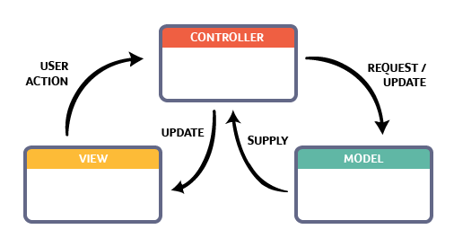

## MVC

Model–view–controller (usually known as MVC) is a software design pattern that is commonly used for developing web applications. In fact, most web development frameworks (like SparkJava) support this design pattern by default (i.e. they expect you to follow it).

This pattern is used to separate application's concerns:

* **Model** represents an object or JAVA POJO carrying data. 
* **View** represents the visualization of the data that model contains.
* **Controller** is the bridge between the model and view. It controls the data flow into model object and updates the view whenever data changes. 



:::tip
It is a common confusion which of M or C the application logic belongs to! Note MVC is a popular architectural design pattern to structure the "Presentation" layer of an application only. The businness logic of the application goes into the "Businnes" layer in the context of [three-tier architecture](https://en.wikipedia.org/wiki/Multitier_architecture). Finally, the way the data is accessed (e.g., using DAO pattern) belongs to the "Data" layer of the application.
:::

## Building Views using Apache Velocity Template

In our application, we are building the _Views_ using [Apache Velocity](http://velocity.apache.org/) templates. Add the following to your gradle's dependencies:

```grrovy
implementation 'com.sparkjava:spark-template-velocity:2.7.1'
```
So far, we have had three API endpoints, namely `/`, `employers` (HTTP Get) and `employers` (HTTP Post).

## `/` View

We currently have a homepage which only shows a simple message "Welcome to JBApp!". Let's improve this by saving the view in a separate HTML file under `src/main/resources/public/index.html`:

```html
<!DOCTYPE html>
<html lang="en">
<head>
    <meta charset="UTF-8">
    <meta name="viewport" content="width=device-width, initial-scale=1, shrink-to-fit=no">
    <title>Welcome to JBApp!</title>
</head>
<body>
    <h1>Welcome to JBApp!</h1>
    <div>
        <p><a href="/employers">Show all employers</a></p>
        <p><a href="/addemployer">Add an employer</a></p>
    </div>
</body>
</html>
```

## `employers` view
Next, we create a separate view for `/employers` HTTP Get endpoint; write the following in `src/main/resources/public/employers.vm`:

```html
<!doctype html>
<html lang="en">
<head>
    <!-- Required meta tags -->
    <meta charset="utf-8">
    <meta name="viewport" content="width=device-width, initial-scale=1, shrink-to-fit=no">
    <title>List of employers</title>
</head>
<body>
    #if ($employers)
    <h1>List of all employers:</h1>
    <div class="divContents">
        <ol>
            <p>
                #foreach($em in $employers )
                    <li>
                        <i>$em.name</i> is a ($em.sector) company: $em.summary.
                    </li>
                #end
            </p>
        </ol>
    </div>
    #end
</body>
</html>
```

Note:

```html
#if ($employers)
.
.
.
#end
```

and the following:

```html
#foreach($em in $employers )
    <li>
        <i>$em.name</i> is a ($em.sector) company: $em.summary.
    </li>
#end
```

These are Velocity Template Language (VTL) statements. VTL provides an easy way to incorporate dynamic content in a web page. HTML pages are static meaning that their content is fixed, but quite often the content we'd like to present is dynamic. For example, in the `employers` view here, we'd like to list all the employers from the `employers` table.

Using the above VTL statements, we show all the employers inside an ordered HTML list (i.e. `<ol>`), where each employer is a list item (i.e. `<li>`). You can see
that we iterate through `employers` and for each `employer` in `employers`, we show employer's name, sector and summary e.g. _Nestle is a Food company: The world's largest food comapny: _ Now, comes the question where do we get `employers` from? The answer is the **Model**. The dynamic data that we'd like to make a part of
our **view** should be stored in the **model** objects: **Controller** does this for us!

## Controller

We must tell our web server to **route** to `employers` view (i.e. page) when browser is pointed at [`http://localhost:7000/employers`](http://localhost:7000/employers). Update the following routes in `Main.main`:

```java
Spark.get("/", (req, res) -> {
    Map<String, Object> model = new HashMap<>();
    return new ModelAndView(model, "public/index.html");
}, new VelocityTemplateEngine());
```

```java
Spark.get("/employers", (req, res) -> {
    List<Employer> ls = getEmployerORMLiteDao().queryForAll();
    Map<String, Object> model = new HashMap<String, Object>();
    model.put("employers", ls);
    return new ModelAndView(model, "public/employers.vm");
}, new VelocityTemplateEngine());
```

After running the WebServer, point your browser to [`http://localhost:7000/`](http://localhost:7000/) on the homepage, click on the _Show all employers_ link and you must be redirected to [`http://localhost:7000/employers`](http://localhost:7000/employers) where all employers from `employers` table are listed.

