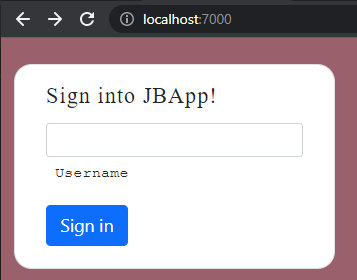
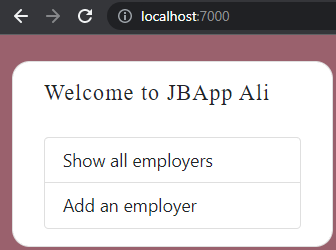

Although you can do everything style-related using pure CSS, using a library/framework can make your life much easier as they come with lots of different pre-built designs, layouts, components, etc. that can readily be used out-of-the-box. Pure CSS gives you maximum flexibility and customization power on however you want to style your content, but the cost is the time/energy to do all the bits of the work on your own. Libraries/Frameworks on the other hand allow you to set up a nice looking front-end in matter of minutes but they decrease (to some extent) your customization flexibility. 

## Bootstrap

[Bootstrap](https://getbootstrap.com/docs/5.0/getting-started/introduction/) is the most popular CSS framework which is free and open-source. Bootstrap can help you make clean, responsive, and nice-looking websites without having to remember the gritty details about styling and layout.

### Getting started with Bootstrap

Go to `top.vm` and replace the following:


```html
<link rel="stylesheet" href="css/jbapp.css">
```

with:

```html
<link href="https://cdn.jsdelivr.net/npm/bootstrap@5.0.2/dist/css/bootstrap.min.css" rel="stylesheet" integrity="sha384-EVSTQN3/azprG1Anm3QDgpJLIm9Nao0Yz1ztcQTwFspd3yD65VohhpuuCOmLASjC" crossorigin="anonymous">
```

This incorporates bootstrap 5 into your html files. Next, go to `bottom.vm` and add the folowing right before `</body>`

```html
<script src="https://cdn.jsdelivr.net/npm/bootstrap@5.0.2/dist/js/bootstrap.bundle.min.js" integrity="sha384-MrcW6ZMFYlzcLA8Nl+NtUVF0sA7MsXsP1UyJoMp4YLEuNSfAP+JcXn/tWtIaxVXM" crossorigin="anonymous"></script>
```

Some of bootstrap's functionalities depend on JS code, so we need to incorporate bootstrap's JS script too. It is best to have this as the very last thing in the `body` of the html files so we that is why we put it in `bottom.vm`.

Now, modify `index.vm` to be the following:

```html
#set( $title = "Welcome Page" )
#parse("public/top.vm")

<div class="vh-100" style="background-color: #9A616D;">
    <div class="container-fluid p-4">
        <div class="row no-gutters">
            <div class="card col-3" style="border-radius: 1rem;">
                <div class="card-body p-3 text-black">
                    #if($username)
                        <h5 class="fw-normal mb-1 pb-2" style="font-family: 'Helvetica font'; letter-spacing: 1px;">Welcome to JBApp $username</h5>
                        <div class="list-group pt-3">
                            <a class="list-group-item list-group-item-action" href="/employers">Show all employers</a>
                            <a class="list-group-item list-group-item-action" href="/addemployers">Add an employer</a>
                        </div>
                    #else
                        <form action="/" method="post">
                            <h5 class="fw-normal mb-1 pb-2" style="font-family: 'Helvetica font'; letter-spacing: 1px;">Sign into JBApp!</h5>
                            <div class="form-outline mb-1">
                                <input type="text" name="username" id="username" class="form-control form-control-sm" required/>
                                <label class="form-label form-control-sm" style="font-family: 'Courier New';" for="username">Username</label>
                            </div>
                            <div class="mb-1">
                                <input class="btn btn-primary btn-block" type="submit" value="Sign in"/>
                            </div>
                        </form>
                    #end
                </div>
            </div>
        </div>
    </div>
</div>

#parse("public/bottom.vm")
```

Now, re-run the application and the sign-in page would look like:



And the front page would be:



As you can see the entire body of the html page above is being _contained_ in a bootstrap `container`! .`.container-fluid` class provides a full width container, spanning the entire width of the viewport. Containers are the most basic layout element in Bootstrap and are required when using the default grid system. Containers are used to contain, pad, and (sometimes) center the content within them. 

The sign-in view is a [`card`](https://getbootstrap.com/docs/5.0/components/card/) and the homepage view is essentially just a [list group](https://getbootstrap.com/docs/5.0/components/list-group/) of hyperlinks, both of which are among commonly-used bootstrap components!

What we did `index.vm` only gives "style" to the sign-in and homepage views, but you can easily make the other pages in JBApp look nicer as well using bootstrap.

:::tip
Even though Bootstrap is the most popular CSS framework, it is not the only one out there. See [this](https://geekflare.com/best-css-frameworks/) for pros&cons of 14 different popular CSS frameworks.
:::
