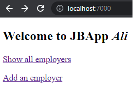
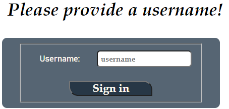

## Let's face the problem!

Our JBApp fron-end looks nothing like an app that would attract users!



:::tip
The look and feel of an app and how user-friendly/intuitive its front-end is can very well make the entire differnece between a successful app (that people love and would pay for) and a failure (that quickly goes out of competition.)
:::

## Styling in HTML

The good news is that styling a web-app is not that difficult. To start, we can add _style attributes_ to HTML. For example, suppose I want the header _Welcome to JBApp_ to be displayed in a specific font face and in italic . I can simply add a _style attribute_ to the header tag in the `index.vm`

```html
<h1 style="font-family: Book Antiqua, serif; font-style: italic; padding: 10px;">Welcome to JBApp $username</h1>
```

The `style="font-family: Book Antiqua, serif; font-style: italic; padding: 10px;"` tells the browser to display whatever is written between the `<h2></h2>` with `Book Antiqua` font face (`serif` if `Book Antiqua` is not available). It also specifies that the text should be displayed in _italic_ and also some "padding" must be added to create extra space around the header.


:::info The HTML Style Attribute
Setting the style of an HTML element can be done with the style attribute. The HTML style attribute has the general form of: `<tagname style="property1:value; property2:value; ... ; propertyN=value;">`.
:::

If I want to apply the same style to the entire content of every page of the JBApp App, I can add the _style attribute_ to the "body" element inside the `top.vm`.

```html
<body style="font-family: Book Antiqua, serif;">
```

HTML elements that are nested inside the `<body></body>` will _inherit_ the style attribute of `<body>` element. 

:::tip
Look at **w3school**'s notes on [HTML Styles](https://www.w3schools.com/html/html_styles.asp) and [HTML Formatting](https://www.w3schools.com/html/html_formatting.asp) for an overview of most commonly used styling/formatting properties.
:::

## Styling HTML with CSS

CSS stands for Cascading Style Sheets. When styling HTML files, it is considered a good practice to **separate** the _styling_ part from the content. The style can be defined in (one or more) CSS files and be linked from the HTML page(s).

:::info
CSS saves a lot of work as it can control the style of multiple web pages all at once.
:::

Let's do this together; follow these steps:

* Create the following folder `src/main/resources/public/css`
* Create the file `jbapp.css` inside the `css` folder.
* Add the following to the `jbapp.css`: 
* In `index.vm` and `employers.vm`, add `class="container"` as an attribute to the outtermost `div` tag i.e. `<div class="container">` 
   
```css
h1, h2 {
    font-family: "Book Antiqua", serif;
    font-style: italic;
    padding: 10px;
}
.container, form {
    background: #566573;
    text-align: left;
    border-radius: 9px;
    padding: 10px 30px 10px 30px;
    float: left;
}

form button, form input[type=submit] {
    background: #273746 ;
    color: floralwhite;
    font-family: "Book Antiqua", serif ;
    font-weight: bolder;
    font-size: 20px;
    padding: 0 40px 0 40px;
    border-radius: 0 16px 0 16px;
    margin:0 auto;
    display:block;
}

.container, form label {
    padding: 22px;
    font-size: 15px;
    color: floralwhite;
    font-family: Bahnschrift, serif;
}

form input[type=text], input[type=number], textarea, select {
    padding: 5px;
    margin: 5px;
    font-family: "Book Antiqua", serif;
    font-weight: bold;
    font-size: 14px;
    border-radius: 6px;
}
```

* Update `top.vm` and add the following line after the `<title>` tag: 

```html
<link rel="stylesheet" href="css/jbapp.css">
```

* Finally, add the following line at the start of `Server.main`

```java
staticFiles.location("/public");
```

:::tip "Static files"
In web development lingo, _static files_ are the files that don't change during user's interaction with the web application. Their content will be delivered "as is" from server to client (and a client like a browser usually caches such files so it would not need to download it over when you revisit the page).
:::

:::info 
Before running the application, make sure you have deleted the _inline_ styling that was added inside the HTML (.vm) file in the previous part.
:::

Now run the application and checkout the styling effect. For instance, the sign-in page should look like:




This is still nowhere near a perfect looking app, but it is an improvement from what we had.

### CSS Selectors

If you look carefully at the CSS file's content, we have a bunch of _selectors_ and a list of stylings that we want applied to all elements selected by that selector. There are three main kinds of (css) selectors: 
1. Selecting by element type e.g. the `h1, h2` selector at the top of `jbapp.css`
1. Selecting by elements' attributes, specifically:
    * `id`: a unique identifier that you can assign to an html element. These selectors start with `#`.
    * `class`: a identifier that can be assigned to multiple elements to form a group of elements e.g. `container` class that was added to div tags in `index.vm` and `employers.vm`. Class selectors start with dot i.e., `.container`.
1. Selecting based on where an element is located relative to other elements e.g. `form button` would select "bottons" that are inside a "form".
    
An overview of CSS selectors can be found [here](https://www.w3schools.com/cssref/css_selectors.asp).

### CSS Properties

Here are some common CSS properties:

```css
background-color: teal; 
color: blue; /* sets the content (text) color */
/* color can be one of ~140 named colors, or a hexadecimal value that represents an RGB value */ 

text-align: left; /* other possible values are center, right, or justify */

height: 150px; /* sets the height of an area */
width: 150px; /* sets the width of an area */
/* arguments in pixels often can take a percentage or relative values too */

margin: 30px; /* sets the margin around all four sides of an area */
/* margin also be broken up into "margin-left", "margin-right", "margin-top", and "margin-bottom" */
padding: 20px; /* sets the padding around text inside an area */
/* padding be broken up the same way as "margin" */

border: 3px solid blue; /* sets a border around an area */

font-family: Arial, sans-serif; /* sets the font family to be used */
font-size: 28px; /* sets the font size */
font-weight: bold; /* sets the font weight to quality, a relative measure ("lighter"), or a number ("200") */
```


:::info Case in point
With CSS, you can change the look of an entire web site, by changing one file!
:::

:::tip Resources
There is **a lot** that you can do with CSS. A great reference (including tutorials) is [Mozilla's MDN Web docs on CSS](https://developer.mozilla.org/en-US/docs/Web/CSS).
:::


