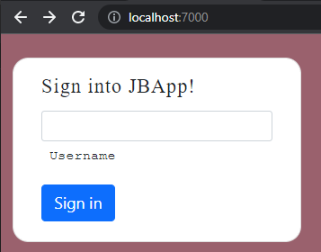

## Input validation

Run the application, go to the homepage and hit on the `Sign in` button (without adding any information for the username); what will happen?




Anyone can sign into the app without even entering a username! We probably should not allow this! One easy and clean way to prevent this is to add in the `required` attribute to the textbox:

```html
<input type="text" name="username" id="username" class="form-control form-control-sm" required/>
```

Now, if `Sign in` button is pressed while the textbox is empty, we get:


This does the trick for us, but (to get warmed up witg JS!) let's say we prefer to show a dialogbox with some customized message in it instead.

## JavaScript

JavaScript is a programming language designed to be run inside a web browser. There are several different versions of JavaScript that are supported by different browsers, but there are certain standard versions that are supported by most. In this class, we will **not** teach JavaScript (although it is very likely that you end up using it-at small or large-for your project). 

:::tip
[Mozilla MDN Web docs on JavaScript](https://developer.mozilla.org/en-US/docs/Web/JavaScript) is a great resource to start learning about JS. There are tutorials in there for absolute beginners to advanced users, as well as pointers to other references, tools and resources. JavaScript started at Netscape, the mother company of Mozilla.  
:::

Let's do some client-side input validation! Follow these steps:

* Create the following folder `src/main/resources/public/js`
* Create the file `validate.js` inside the `js` folder.
* Update `index.vm` and add the following line at the bottom before the last `#parse`

```html
<script src="/js/validate.js"></script>
```

* Make sure `required` is removed and `id` attribute on the _input element_ for username text field is set:

```html
<input type="text" name="username" id="username" class="form-control form-control-sm"/>
```

* We will use the `id` attribute to access the value of the input element inside JavaScript code; let's open `validate.js` and add the following to it:

```js
function validateUsername() {
    const name = document.getElementById("username");
    if (name.value.length < 1) {
        alert("Username cannot be empty!");
        return false;
    } else {
        return true;
    }
}
```

:::tip
In the `validateUsername`function above, `document.getElementById("username")` is accessing a particular element in the HTML page via Document Object Model (DOM). When an HTML page is loaded, the browser creates a DOM of the page, which is an object oriented tree-like representation of the loaded HTML document that acts as an interface between JavaScript and the document itself. in JavaScript, you can access DOM by `document` and add/remove/manipulate the HTML elements of the page.
:::

* Finally, update `index.vm` and add an _event listener_ to the _form element_ so that upon submission of the form, the `validateUsername` function is invoked and the form is submitted if and only if that function returned _true_:

```html
<form action="/" method="post" onsubmit="return validateUsername();">
```

Now run the application again, and try to sign in without providing a user name; you must get the following:


:::tip
You can have much nicer functional dialogboxes in your app using [bootsrap's modals](https://getbootstrap.com/docs/4.0/components/modal/).
:::
