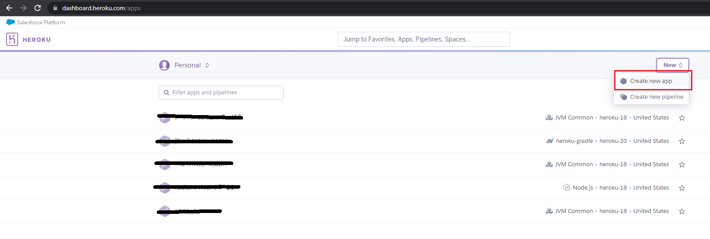

:::info
Continuous Delivery (or Continuous Deployment, or CD) is a software engineering approach in which software functionalities are delivered frequently through automated deployments. 
:::

We will be using [Heroku](https://www.heroku.com/), a platform as a service ([PaaS](https://en.wikipedia.org/wiki/Platform_as_a_service)) based on a managed container system, with integrated data services, for deploying and running software applications. Heroku is primed for continuous delivery.[^1] It is, in a nutshell, a cloud application platform that lets you deploy your server online. By taking care of most things related to deployment, it makes it easy to get your application up and running.

[^1]: Read more about Continuous Delivery on Heroku at [https://www.heroku.com/continuous-delivery](https://www.heroku.com/continuous-delivery).

## Deploying SparkJava on Heroku  

Before we get started, you must:

* Create a free Heroku account ([sign up](https://signup.heroku.com/dc))
* Install the [Heroku CLI](https://toolbelt.heroku.com/)

### Build a simple SparkJava App

Create a new Gradle Java project `Heroku-Demo` in IntelliJ and add the following dependencies to it

```groovy
implementation 'com.sparkjava:spark-core:2.9.3'
implementation 'org.slf4j:slf4j-simple:2.0.0-alpha4'
```

Create the following Java class:

```java
import static spark.Spark.get;
import static spark.Spark.port;

public class Server {
  final static int PORT = 7000;
    
  public static void main(String[] args) {
      port(PORT);
      get("/", (req, res) -> "Hi Heroku!");
  }
}
```

You can run this application and point your browser to [`http://localhost:7000/`](http://localhost:7000/) to see the `Hi Heroku!` message!

### Prepare to deploy

We want to package our SparkJava application as a single executable file that can be run on Heroku. We are going to make a _fat_ `JAR` file[^2] for this purpose. A fat JAR contains your application and all the dependencies needed to run your application. 

[^2]: JAR stands for Java ARchive. It is used for aggregating many Java files into one. It is the preferred way to bundle a Java application. Read more on [Oracle's website](https://docs.oracle.com/javase/8/docs/technotes/guides/jar/jarGuide.html).

Gradle is able to package your Java application into a JAR file but, by default, it does so without including the project dependencies.
We can overwrite the default behavior by adding a few lines to the project's `build.gradle`:

```groovy
jar {
    duplicatesStrategy = DuplicatesStrategy.EXCLUDE
    manifest {
        attributes 'Main-Class' : 'Server'
    }
    from {
        configurations.runtimeClasspath.collect { it.isDirectory() ? it : zipTree(it) }
    }
}
```

Now you can run Gradle's `jar` task: open the terminal at the root directory of your Java project and type the following command:[^3]

```shell
$ ./gradlew build jar
```

[^3]: You can also run this _task_ in IntelliJ from the [Gradle Tool Window](https://www.jetbrains.com/help/idea/jetgradle-tool-window.html)

Once the process is finished, you can find your newly packaged JAR file in the `build/libs` directory. Verify that the archive is valid by running the following command:

```shell
$ java -jar build/libs/Heroku-Demo-1.0-SNAPSHOT.jar
```

### Heroku Gradle Plugin 

To deploy Gradle based JVM applications directly to Heroku, we will use a [heroku-gradle plugin](https://github.com/heroku/heroku-gradle). Add the plugin to your `build.gradle`:

```groovy
plugins {
  id 'java'
  id "com.heroku.sdk.heroku-gradle" version "2.0.0"
}
```

Moreover, you need to add a configuration for the heroku-gradle plugin; add the following to your `build.gradle`:

```groovy
heroku {
    jdkVersion = 8
    processTypes(
        web: "java -jar build/libs/Heroku-Demo-1.0-SNAPSHOT.jar"
    )
}
```

### Making SparkJava Listen on the Correct Port

When we deployed SparkJava locally, we used the `7000` port on `localhost`. Heroku assigns your application a new port every time you deploy it, so we have to get this port and tell SparkJava to use it:

```java
import static spark.Spark.get;
import static spark.Spark.port;

public class Server {
  static int PORT = 7000;

  private static int getPort() {
      String herokuPort = System.getenv("PORT");
      if (herokuPort != null) {
          PORT = Integer.parseInt(herokuPort);
      }
      return PORT;
  }

  public static void main(String[] args) {
    port(getPort());
    get("/", (req, res) -> "Hi Heroku!");
  }
}
```

:::tip
A single app runs in different environments, for example on your development machine when developing the app and on the cloud (e.g. Heroku) in production. Although you run the same exact code, but the environments usually (almost always!) have their own environment-specific configurations. An app’s environment-specific configuration can be stored in environment variables (and not in the app’s source code). In the above code, we get the value of `PORT` env variable since Heroku automatically sets that env variable value when running an app. Thus, we can use that to decide if the app is currently running on Heroku or not.
:::


### Heroku & Git

Heroku is deeply integrated with the Git workflow. However, `heroku-gradle` plugin that we listed under `plugins` is used to deploy Gradle-based JVM applications directly to Heroku without pushing to a Git repository.


### Deploy

Before deployment, you must create a Heroku app. You acn login to your Heroku account on [www.heroku.com](https://www.heroku.com/) and create a new app:



Then, do the following on the terminal:

```shell
$ git init
$ heroku git:remote -a your-heroku-app-name-goes-here
```

:::tip
You must have Heroku CLI installed in order for this command to work!
:::


Next, open your `build.gradle` file and add the following under `heroku`:


Then, run the following command:[^4]

```shell
$ ./gradlew build deployHeroku
```

[^4]: You can configure IntelliJ to run this _task_ by following the instructions [here](https://devcenter.heroku.com/articles/deploying-java-applications-to-heroku-from-eclipse-or-intellij-idea#deploying-from-intellij-idea).

If all goes well, you will get a message that looks similar to the following:

```shell
> Task :deployHeroku
-----> Packaging application...
       - including: build\classes\java\main\Server.class
       - including: build\libs\heroku-demo-1.0-SNAPSHOT.jar
       - including: build\tmp\compileJava\previous-compilation-data.bin
       - including: build\tmp\jar\MANIFEST.MF
-----> Creating build...
       - file: C:\Users\Ali\AppData\Local\Temp\heroku-deploy3926677424279110861source-blob.tgz
       - size: 2MB

locking FileBasedConfig[C:\Users\Ali\.config\jgit\config] failed after 5 retries

> Task :deployHeroku
-----> Uploading build...
       - success
-----> Deploying...
remote: 
remote: -----> Building on the Heroku-20 stack
remote: -----> Using buildpack: heroku/jvm
remote: -----> heroku-gradle app detected
remote: -----> Installing JDK 1.8... done
remote: -----> Discovering process types
remote:        Procfile declares types -> web
remote: 
remote: -----> Compressing...
remote:        Done: 54.5M
remote: -----> Launching...
remote:        Released v3
remote:        https://jhu-heroku-demo.herokuapp.com/ deployed to Heroku
remote: 
-----> Done
```

You can point your browser to the URL of your Heroku application. For example, the example above is deployed at [https://jhu-heroku-demo.herokuapp.com/](https://jhu-heroku-demo.herokuapp.com/).

   